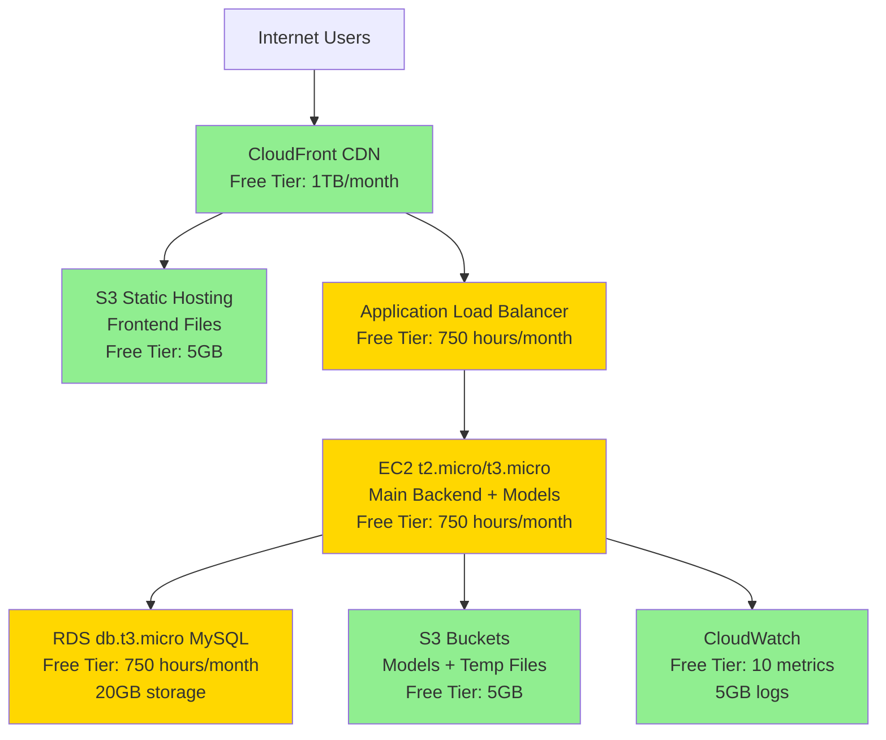

# Design Document: AWS Free Tier Optimization Plan

## Overview

This design document outlines a comprehensive AWS deployment strategy for the AFIRGen system that maximizes the use of AWS Free Tier services while maintaining acceptable performance and reliability. The plan complements the existing frontend-optimization and backend-optimization specs by providing specific AWS service configurations that stay within free tier limits.

The AWS Free Tier provides 12 months of free services for new accounts, plus always-free services. This design leverages both to create a cost-effective deployment suitable for development, testing, and low-traffic production workloads (up to 100 requests/day).

## Architecture

### High-Level Architecture




### Architecture Decisions

**Single EC2 Instance Strategy:**
- Run all services (backend, GGUF, ASR/OCR) on one t2.micro/t3.micro instance
- Use Docker Compose for service orchestration
- Optimize memory usage through model quantization and lazy loading
- Accept longer processing times (60-90s for FIR generation vs 30s in production)

**Frontend on S3 + CloudFront:**
- Static files served from S3 with CloudFront CDN
- Zero compute cost for frontend
- Global distribution with low latency
- Automatic HTTPS via CloudFront

**Simplified Database:**
- Single RDS db.t3.micro instance (no Multi-AZ)
- 20GB storage limit (free tier)
- Automated backups to S3 (within free tier)
- Accept potential downtime during maintenance

**Cost-Free Monitoring:**
- CloudWatch free tier: 10 custom metrics, 5GB logs
- Focus on critical metrics only
- 7-day log retention
- Manual alerting via CloudWatch console

## Components and Interfaces

### 1. Frontend Deployment (S3 + CloudFront)

**S3 Bucket Configuration:**
```python
class S3FrontendConfig:
    bucket_name: str = "afirgen-frontend-{account-id}"
    region: str = "us-east-1"
    versioning: bool = True
    lifecycle_rules: List[LifecycleRule] = [
        LifecycleRule(
            id="delete-old-versions",
            status="Enabled",
            noncurrent_version_expiration_days=7
        )
    ]
    website_configuration: WebsiteConfig = WebsiteConfig(
        index_document="index.html",
        error_document="index.html"
    )
```


**CloudFront Distribution:**
```python
class CloudFrontConfig:
    origin: S3Origin = S3Origin(
        domain_name="afirgen-frontend-{account-id}.s3.amazonaws.com",
        origin_access_identity="cloudfront-oai"
    )
    default_cache_behavior: CacheBehavior = CacheBehavior(
        viewer_protocol_policy="redirect-to-https",
        allowed_methods=["GET", "HEAD", "OPTIONS"],
        cached_methods=["GET", "HEAD"],
        compress=True,
        default_ttl=86400,  # 24 hours
        max_ttl=31536000    # 1 year
    )
    price_class: str = "PriceClass_100"  # US, Canada, Europe only
    ssl_certificate: str = "cloudfront-default"  # Free HTTPS
```

**Free Tier Limits:**
- Data transfer out: 1TB/month (sufficient for ~10,000 page loads)
- HTTP/HTTPS requests: 10 million/month
- No charge for data transfer from S3 to CloudFront

### 2. Backend Deployment (Single EC2 Instance)

**EC2 Instance Configuration:**
```python
class EC2InstanceConfig:
    instance_type: str = "t2.micro"  # 1 vCPU, 1GB RAM (free tier)
    # Alternative: t3.micro (2 vCPU, 1GB RAM, better performance)
    
    ami: str = "ami-ubuntu-22.04-lts"
    volume_size: int = 30  # GB (free tier: 30GB)
    volume_type: str = "gp3"  # Free tier includes gp2/gp3
    
    security_group_rules: List[SecurityGroupRule] = [
        SecurityGroupRule(type="ingress", port=80, cidr="0.0.0.0/0"),
        SecurityGroupRule(type="ingress", port=443, cidr="0.0.0.0/0"),
        SecurityGroupRule(type="ingress", port=22, cidr="your-ip/32"),
        SecurityGroupRule(type="egress", port=0, cidr="0.0.0.0/0")
    ]
    
    user_data: str = """#!/bin/bash
    # Install Docker and Docker Compose
    apt-get update
    apt-get install -y docker.io docker-compose
    systemctl enable docker
    systemctl start docker
    
    # Download application code
    cd /opt
    git clone https://github.com/your-repo/afirgen.git
    cd afirgen
    
    # Download models from S3 (one-time setup)
    aws s3 sync s3://afirgen-models-{account-id}/ ./models/
    
    # Start services
    docker-compose -f docker-compose.free-tier.yml up -d
    """
```


**Docker Compose Configuration for Free Tier:**
```yaml
# docker-compose.free-tier.yml
version: '3.8'

services:
  main-backend:
    build: ./main backend
    container_name: afirgen-backend
    ports:
      - "8000:8000"
    environment:
      - MYSQL_HOST=afirgen-db.xxxxx.us-east-1.rds.amazonaws.com
      - MYSQL_PORT=3306
      - MYSQL_USER=${MYSQL_USER}
      - MYSQL_PASSWORD=${MYSQL_PASSWORD}
      - GGUF_SERVER_URL=http://localhost:8001
      - ASR_OCR_SERVER_URL=http://localhost:8002
      - ENVIRONMENT=free-tier
      - MAX_WORKERS=1  # Limit concurrency for low memory
    volumes:
      - ./kb:/app/kb:ro
      - ./chroma_kb:/app/chroma_kb
      - ./sessions.db:/app/sessions.db
    mem_limit: 300m  # Limit memory usage
    restart: unless-stopped
    depends_on:
      - gguf-server
      - asr-ocr-server

  gguf-server:
    build: ./gguf model server
    container_name: afirgen-gguf
    ports:
      - "8001:8001"
    environment:
      - MODEL_DIR=/app/models
      - MODEL_QUANTIZATION=Q4_K_M  # Use quantized models
      - MAX_CONTEXT_LENGTH=2048  # Reduce context for memory
    volumes:
      - ./models:/app/models:ro
    mem_limit: 400m
    restart: unless-stopped

  asr-ocr-server:
    build: ./asr ocr model server
    container_name: afirgen-asr-ocr
    ports:
      - "8002:8002"
    environment:
      - MODEL_DIR=/app/models
      - WHISPER_MODEL=base  # Use smaller Whisper model
    volumes:
      - ./models:/app/models:ro
      - ./temp_asr_ocr:/app/temp_asr_ocr
    mem_limit: 300m
    restart: unless-stopped

  nginx:
    image: nginx:alpine
    container_name: afirgen-nginx
    ports:
      - "80:80"
      - "443:443"
    volumes:
      - ./nginx/nginx.conf:/etc/nginx/nginx.conf:ro
      - ./nginx/ssl:/etc/nginx/ssl:ro
    mem_limit: 50m
    restart: unless-stopped
    depends_on:
      - main-backend
```

**Memory Optimization Strategy:**
- Total available: 1GB RAM
- OS overhead: ~200MB
- Main backend: 300MB
- GGUF server: 400MB (largest models)
- ASR/OCR server: 300MB
- Nginx: 50MB
- Buffer: ~50MB for spikes
- **Total: ~1000MB** (tight but feasible)


### 3. Database Layer (RDS Free Tier)

**RDS Configuration:**
```python
class RDSFreeT ierConfig:
    instance_class: str = "db.t3.micro"  # 2 vCPU, 1GB RAM
    # Alternative: db.t2.micro (1 vCPU, 1GB RAM)
    
    engine: str = "mysql"
    engine_version: str = "8.0"
    allocated_storage: int = 20  # GB (free tier limit)
    storage_type: str = "gp2"
    
    multi_az: bool = False  # Not available in free tier
    backup_retention_period: int = 7  # Days (free tier: 1 backup/day)
    backup_window: str = "03:00-04:00"  # UTC
    maintenance_window: str = "sun:04:00-sun:05:00"
    
    publicly_accessible: bool = False
    vpc_security_group_ids: List[str] = ["sg-backend-access"]
    
    parameters: Dict[str, Any] = {
        "max_connections": 50,  # Reduced for low memory
        "innodb_buffer_pool_size": 512 * 1024 * 1024,  # 512MB
        "query_cache_size": 0,  # Disabled (deprecated in MySQL 8.0)
        "slow_query_log": 1,
        "long_query_time": 2
    }
```

**Database Optimization for Free Tier:**
- Limit connections to 50 (vs 150 in production)
- Reduce buffer pool size to 512MB
- Disable query cache (not needed for low traffic)
- Enable slow query log for optimization
- Use connection pooling in application (max 5 connections)

**Storage Management:**
```python
class StorageManagement:
    def cleanup_old_data():
        """Delete old validation history to stay under 20GB"""
        DELETE FROM validation_history 
        WHERE created_at < DATE_SUB(NOW(), INTERVAL 90 DAY);
        
        DELETE FROM fir_records 
        WHERE status = 'archived' 
        AND completed_at < DATE_SUB(NOW(), INTERVAL 180 DAY);
    
    def monitor_storage():
        """Alert when storage exceeds 18GB (90% of limit)"""
        SELECT 
            table_schema,
            SUM(data_length + index_length) / 1024 / 1024 / 1024 AS size_gb
        FROM information_schema.tables
        GROUP BY table_schema;
```


### 4. Storage Layer (S3 Free Tier)

**S3 Bucket Strategy:**
```python
class S3BucketConfig:
    buckets: List[Bucket] = [
        Bucket(
            name="afirgen-models-{account-id}",
            purpose="Store ML models (one-time download)",
            size_estimate="3-5GB",
            lifecycle_policy=None  # Keep models permanently
        ),
        Bucket(
            name="afirgen-temp-{account-id}",
            purpose="Temporary file uploads",
            size_estimate="<100MB",
            lifecycle_policy=LifecyclePolicy(
                expiration_days=1  # Delete after 1 day
            )
        ),
        Bucket(
            name="afirgen-backups-{account-id}",
            purpose="Database backups",
            size_estimate="<500MB",
            lifecycle_policy=LifecyclePolicy(
                transition_to_glacier_days=30,
                expiration_days=90
            )
        )
    ]
    
    # Free Tier Limits:
    # - 5GB storage
    # - 20,000 GET requests/month
    # - 2,000 PUT requests/month
```

**Model Storage Optimization:**
```python
class ModelOptimization:
    """Reduce model sizes to fit in free tier"""
    
    models: Dict[str, ModelConfig] = {
        "gguf_summariser": ModelConfig(
            original_size="7GB",
            quantized_size="2.5GB",
            quantization="Q4_K_M",
            accuracy_loss="<5%"
        ),
        "gguf_bns_check": ModelConfig(
            original_size="7GB",
            quantized_size="2.5GB",
            quantization="Q4_K_M",
            accuracy_loss="<5%"
        ),
        "whisper_base": ModelConfig(
            original_size="290MB",
            optimized_size="290MB",
            quantization=None,
            accuracy_loss="0%"
        ),
        "dots_ocr": ModelConfig(
            original_size="150MB",
            optimized_size="150MB",
            quantization=None,
            accuracy_loss="0%"
        )
    }
    
    total_size: str = "~5GB"  # Fits in free tier
```


### 5. Monitoring Layer (CloudWatch Free Tier)

**CloudWatch Configuration:**
```python
class CloudWatchFreeConfig:
    # Free Tier Limits:
    # - 10 custom metrics
    # - 10 alarms
    # - 5GB log ingestion
    # - 5GB log storage
    # - 1 million API requests
    
    custom_metrics: List[Metric] = [
        Metric(name="FIR/GenerationTime", unit="Seconds"),
        Metric(name="FIR/GenerationCount", unit="Count"),
        Metric(name="API/ErrorRate", unit="Percent"),
        Metric(name="API/ResponseTime", unit="Milliseconds"),
        Metric(name="System/CPUUtilization", unit="Percent"),
        Metric(name="System/MemoryUtilization", unit="Percent"),
        Metric(name="Database/ConnectionCount", unit="Count"),
        Metric(name="Database/QueryTime", unit="Milliseconds"),
        Metric(name="Model/InferenceTime", unit="Seconds"),
        Metric(name="Storage/DiskUsage", unit="Percent")
    ]
    
    alarms: List[Alarm] = [
        Alarm(
            name="HighErrorRate",
            metric="API/ErrorRate",
            threshold=10,  # 10% error rate
            evaluation_periods=2,
            action="email"  # SNS email (free tier: 1000 emails/month)
        ),
        Alarm(
            name="HighCPU",
            metric="System/CPUUtilization",
            threshold=90,
            evaluation_periods=3,
            action="email"
        ),
        Alarm(
            name="HighMemory",
            metric="System/MemoryUtilization",
            threshold=95,
            evaluation_periods=2,
            action="email"
        ),
        Alarm(
            name="DatabaseStorageFull",
            metric="Storage/DiskUsage",
            threshold=90,
            evaluation_periods=1,
            action="email"
        )
    ]
    
    log_groups: List[LogGroup] = [
        LogGroup(
            name="/aws/ec2/afirgen",
            retention_days=7,  # Minimize storage costs
            size_estimate="1GB/month"
        ),
        LogGroup(
            name="/aws/rds/afirgen-mysql",
            retention_days=7,
            size_estimate="500MB/month"
        )
    ]
```


**Log Optimization Strategy:**
```python
class LogOptimization:
    """Minimize log volume to stay under 5GB/month"""
    
    strategies: List[Strategy] = [
        Strategy(
            name="Structured Logging",
            description="Use JSON format, log only essential fields",
            savings="30% reduction"
        ),
        Strategy(
            name="Log Level Filtering",
            description="INFO and above only (no DEBUG in production)",
            savings="50% reduction"
        ),
        Strategy(
            name="Sampling",
            description="Log 1 in 10 successful requests, all errors",
            savings="40% reduction"
        ),
        Strategy(
            name="Short Retention",
            description="7-day retention (vs 30 days)",
            savings="75% reduction"
        )
    ]
    
    estimated_volume: str = "1.5GB/month"  # Well under 5GB limit
```

### 6. Networking Layer (Free Tier)

**VPC Configuration:**
```python
class VPCFreeConfig:
    cidr_block: str = "10.0.0.0/16"
    
    subnets: List[Subnet] = [
        Subnet(
            name="public-subnet-1",
            cidr="10.0.1.0/24",
            availability_zone="us-east-1a",
            purpose="EC2 instance, ALB"
        ),
        Subnet(
            name="private-subnet-1",
            cidr="10.0.11.0/24",
            availability_zone="us-east-1a",
            purpose="RDS instance"
        ),
        Subnet(
            name="private-subnet-2",
            cidr="10.0.12.0/24",
            availability_zone="us-east-1b",
            purpose="RDS subnet group (required)"
        )
    ]
    
    # No NAT Gateway (costs $32/month)
    # EC2 in public subnet with Elastic IP (free if attached)
    # RDS in private subnet (accessed via EC2)
    
    internet_gateway: bool = True  # Free
    nat_gateway: bool = False  # Not free, avoid
    
    vpc_endpoints: List[VPCEndpoint] = [
        VPCEndpoint(
            service="s3",
            type="Gateway",
            cost="Free"
        )
        # Skip other endpoints to avoid costs
    ]
```


**Application Load Balancer (Optional):**
```python
class ALBFreeConfig:
    # Free Tier: 750 hours/month (1 ALB for 31 days)
    # LCU hours: 15 free per month (very limited)
    
    enabled: bool = False  # Recommendation: Skip ALB to save costs
    
    # Alternative: Use Nginx on EC2 for SSL termination
    # - Free SSL certificate from Let's Encrypt
    # - No ALB costs
    # - Direct traffic to EC2 instance
    
    alternative_architecture: str = """
    Internet → Route 53 (free for 1 hosted zone) 
            → EC2 Elastic IP (free when attached)
            → Nginx (SSL termination)
            → Docker containers
    """
```

## Data Models

### Free Tier Resource Limits

```python
class FreeTierLimits:
    """AWS Free Tier limits for 12 months"""
    
    compute: ComputeLimits = ComputeLimits(
        ec2_hours=750,  # per month (t2.micro or t3.micro)
        ec2_instances=1,  # effectively
        ec2_storage=30,  # GB
        alb_hours=750,  # per month (1 ALB)
        alb_lcu_hours=15  # per month (very limited)
    )
    
    database: DatabaseLimits = DatabaseLimits(
        rds_hours=750,  # per month (db.t2.micro or db.t3.micro)
        rds_storage=20,  # GB
        rds_backups=20,  # GB (same as storage)
        rds_io_requests=None  # No limit in free tier
    )
    
    storage: StorageLimits = StorageLimits(
        s3_storage=5,  # GB
        s3_get_requests=20000,  # per month
        s3_put_requests=2000,  # per month
        s3_data_transfer_out=15  # GB per month (to internet)
    )
    
    networking: NetworkingLimits = NetworkingLimits(
        data_transfer_out=15,  # GB per month (EC2 to internet)
        data_transfer_in=None,  # Unlimited (free)
        cloudfront_data_transfer=1000,  # GB per month
        cloudfront_requests=10000000  # per month
    )
    
    monitoring: MonitoringLimits = MonitoringLimits(
        cloudwatch_metrics=10,  # custom metrics
        cloudwatch_alarms=10,
        cloudwatch_logs_ingestion=5,  # GB per month
        cloudwatch_logs_storage=5,  # GB
        cloudwatch_api_requests=1000000  # per month
    )
    
    always_free: AlwaysFreeLimits = AlwaysFreeLimits(
        lambda_requests=1000000,  # per month (not used in this design)
        lambda_compute=400000,  # GB-seconds per month
        dynamodb_storage=25,  # GB (not used)
        sns_notifications=1000,  # per month (for alarms)
        cloudwatch_logs_insights_queries=5  # GB scanned per month
    )
```


### Cost Estimation Model

```python
class CostEstimation:
    """Estimated monthly costs within free tier"""
    
    free_tier_services: Dict[str, Cost] = {
        "EC2 t2.micro": Cost(hours=750, cost_per_hour=0, total=0),
        "RDS db.t3.micro": Cost(hours=750, cost_per_hour=0, total=0),
        "S3 storage": Cost(gb=5, cost_per_gb=0, total=0),
        "CloudFront": Cost(gb=1000, cost_per_gb=0, total=0),
        "CloudWatch": Cost(metrics=10, cost_per_metric=0, total=0),
        "Data transfer": Cost(gb=15, cost_per_gb=0, total=0)
    }
    
    potential_overages: Dict[str, Cost] = {
        "S3 GET requests": Cost(
            free=20000,
            overage_per_1000=0.0004,
            estimated_usage=15000,
            overage_cost=0
        ),
        "S3 PUT requests": Cost(
            free=2000,
            overage_per_1000=0.005,
            estimated_usage=1000,
            overage_cost=0
        ),
        "Data transfer out": Cost(
            free_gb=15,
            overage_per_gb=0.09,
            estimated_usage_gb=10,
            overage_cost=0
        )
    }
    
    total_monthly_cost: float = 0.00  # Within free tier
    
    # After 12 months (free tier expires):
    estimated_monthly_cost: float = 25.00  # Approximate
    breakdown_after_free_tier: Dict[str, float] = {
        "EC2 t2.micro": 8.50,  # ~$0.0116/hour * 730 hours
        "RDS db.t3.micro": 12.00,  # ~$0.016/hour * 730 hours
        "S3 storage": 0.50,  # 5GB * $0.023/GB
        "CloudFront": 1.00,  # Minimal usage
        "CloudWatch": 1.00,  # 10 metrics * $0.30
        "Data transfer": 2.00  # 15GB * $0.09/GB
    }
```

## Correctness Properties

### Property 1: Free Tier Limit Compliance
*For any* AWS resource provisioned by the system, the resource configuration SHALL stay within AWS Free Tier limits for compute, storage, and data transfer.

**Validates: Requirements 1.2, 1.3**

**Test Strategy:** Query AWS Cost Explorer API daily, verify $0.00 charges for free tier services, alert if any charges detected.


### Property 2: Memory Constraint Satisfaction
*For any* Docker container running on the EC2 instance, the total memory allocation SHALL not exceed 1GB, with individual container limits enforced to prevent OOM errors.

**Validates: Requirements 2.3, 2.4**

**Test Strategy:** Monitor container memory usage under load, verify no OOM kills, ensure total memory stays under 1GB.

### Property 3: Storage Limit Compliance
*For any* data stored in RDS, the total database size SHALL not exceed 18GB (90% of 20GB limit), with automatic cleanup of old records when threshold is reached.

**Validates: Requirements 5.2, 5.3, 5.4**

**Test Strategy:** Generate test data to approach limit, verify cleanup triggers at 18GB, confirm database remains functional.

### Property 4: Model Loading Performance
*For any* model server startup, models SHALL load from local disk (after initial S3 download) within 60 seconds, enabling service availability despite memory constraints.

**Validates: Requirements 19.2, 19.3**

**Test Strategy:** Restart containers, measure model loading time, verify under 60 seconds for subsequent starts.

### Property 5: Concurrent Request Handling
*For any* set of 3 concurrent FIR generation requests, the system SHALL process all requests without crashing, though processing time may exceed 60 seconds per request.

**Validates: Requirements 6.4, 11.3**

**Test Strategy:** Submit 3 concurrent requests with audio/image inputs, verify all complete successfully, measure processing times.

### Property 6: Frontend Asset Delivery
*For any* static asset request to CloudFront, the asset SHALL be served with HTTPS and appropriate caching headers, with 99% of requests served from cache (not origin).

**Validates: Requirements 4.2, 4.3, 4.4**

**Test Strategy:** Monitor CloudFront metrics, verify cache hit ratio >99%, confirm HTTPS enforcement.

### Property 7: Log Volume Compliance
*For any* 24-hour period, the total log volume ingested to CloudWatch SHALL not exceed 170MB (5GB/month ÷ 30 days), with log sampling and filtering enforced.

**Validates: Requirements 8.3, 18.2**

**Test Strategy:** Monitor daily log ingestion, verify under 170MB/day, test log sampling configuration.

### Property 8: Database Connection Pooling
*For any* application service, the maximum number of database connections SHALL not exceed 5, preventing connection pool exhaustion on the db.t3.micro instance.

**Validates: Requirements 12.1, 12.2**

**Test Strategy:** Monitor active connections under load, verify max 5 connections per service, test connection reuse.


### Property 9: S3 Request Optimization
*For any* model file access, the file SHALL be cached locally on EC2 after first download, with S3 GET requests limited to <100/month to stay well within free tier limits.

**Validates: Requirements 3.5, 10.4, 19.2**

**Test Strategy:** Monitor S3 GET request count, verify models cached locally, confirm <100 requests/month.

### Property 10: Auto-Recovery from OOM
*For any* container that is killed due to OOM, Docker SHALL automatically restart the container within 30 seconds, restoring service availability.

**Validates: Requirements 7.1, 7.2**

**Test Strategy:** Trigger OOM condition, verify container restart, measure recovery time, confirm service restoration.

## Error Handling

### Memory Pressure Scenarios

**Scenario 1: Approaching Memory Limit**
- **Detection:** Memory utilization >90%
- **Response:** 
  - Log warning with current memory breakdown
  - Trigger garbage collection in Python services
  - Defer new requests until memory drops below 85%
- **Recovery:** Queue requests, process sequentially

**Scenario 2: OOM Kill**
- **Detection:** Container exit code 137
- **Response:**
  - Docker automatically restarts container
  - CloudWatch alarm fires
  - Log detailed memory usage before crash
- **Recovery:** Container restarts with fresh memory state

**Scenario 3: Model Loading Failure**
- **Detection:** Model file not found or corrupted
- **Response:**
  - Attempt S3 download (if not already cached)
  - If download fails, mark service unhealthy
  - Return 503 Service Unavailable
- **Recovery:** Manual intervention to fix S3 bucket or model files


### Storage Limit Scenarios

**Scenario 1: RDS Storage >90% Full**
- **Detection:** CloudWatch alarm on storage usage
- **Response:**
  - Trigger automatic cleanup of old validation history
  - Archive old FIR records to S3
  - Send email notification
- **Recovery:** Storage drops below 80%

**Scenario 2: S3 Storage >4.5GB**
- **Detection:** Daily S3 storage check
- **Response:**
  - Delete temporary files older than 1 day
  - Transition old backups to Glacier
  - Alert if still over limit
- **Recovery:** Manual review of S3 contents

**Scenario 3: EC2 Disk >90% Full**
- **Detection:** Disk usage monitoring script
- **Response:**
  - Clean Docker image cache
  - Remove old log files
  - Prune unused Docker volumes
- **Recovery:** Disk usage drops below 80%

### Network and API Limit Scenarios

**Scenario 1: Approaching Data Transfer Limit**
- **Detection:** Data transfer >12GB/month (80% of 15GB)
- **Response:**
  - Enable aggressive response compression
  - Reduce log verbosity
  - Alert administrator
- **Recovery:** Monitor closely, may need to throttle requests

**Scenario 2: S3 Request Limit Exceeded**
- **Detection:** S3 GET requests >18,000/month
- **Response:**
  - Verify local caching is working
  - Identify and fix any request loops
  - May incur small overage charges ($0.01-0.10)
- **Recovery:** Fix caching issues

**Scenario 3: CloudWatch Metric Limit**
- **Detection:** Attempting to create 11th custom metric
- **Response:**
  - Fail gracefully, log error
  - Use existing metrics or combine metrics
  - Document which metrics are most critical
- **Recovery:** Remove least important metric


## Testing Strategy

### Free Tier Compliance Testing

**Cost Monitoring Tests:**
```python
from hypothesis import given, strategies as st, settings
import boto3

# Feature: aws-optimization-plan, Property 1: Free Tier Limit Compliance
@settings(max_examples=100)
@given(
    days_in_month=st.integers(min_value=1, max_value=31)
)
def test_free_tier_cost_compliance(days_in_month):
    """For any day in the month, total AWS costs should be $0.00"""
    ce_client = boto3.client('ce')
    
    response = ce_client.get_cost_and_usage(
        TimePeriod={
            'Start': f'2024-01-{days_in_month:02d}',
            'End': f'2024-01-{days_in_month:02d}'
        },
        Granularity='DAILY',
        Metrics=['UnblendedCost']
    )
    
    total_cost = float(response['ResultsByTime'][0]['Total']['UnblendedCost']['Amount'])
    assert total_cost == 0.00, f"Free tier exceeded: ${total_cost}"
```

**Resource Limit Tests:**
```python
# Feature: aws-optimization-plan, Property 2: Memory Constraint Satisfaction
@settings(max_examples=100)
@given(
    concurrent_requests=st.integers(min_value=1, max_value=5)
)
def test_memory_constraint_satisfaction(concurrent_requests):
    """For any number of concurrent requests, total memory stays under 1GB"""
    import docker
    client = docker.from_env()
    
    # Get memory stats for all containers
    containers = client.containers.list()
    total_memory_mb = 0
    
    for container in containers:
        stats = container.stats(stream=False)
        memory_usage = stats['memory_stats']['usage'] / (1024 * 1024)  # MB
        total_memory_mb += memory_usage
    
    assert total_memory_mb < 1024, f"Memory exceeded: {total_memory_mb}MB"
```


**Storage Limit Tests:**
```python
# Feature: aws-optimization-plan, Property 3: Storage Limit Compliance
@settings(max_examples=100)
@given(
    num_fir_records=st.integers(min_value=100, max_value=10000)
)
def test_storage_limit_compliance(num_fir_records):
    """For any number of FIR records, database size stays under 18GB"""
    import mysql.connector
    
    conn = mysql.connector.connect(
        host=os.getenv('MYSQL_HOST'),
        user=os.getenv('MYSQL_USER'),
        password=os.getenv('MYSQL_PASSWORD'),
        database='fir_db'
    )
    
    cursor = conn.cursor()
    cursor.execute("""
        SELECT 
            SUM(data_length + index_length) / 1024 / 1024 / 1024 AS size_gb
        FROM information_schema.tables
        WHERE table_schema = 'fir_db'
    """)
    
    size_gb = cursor.fetchone()[0]
    assert size_gb < 18, f"Database size exceeded: {size_gb}GB"
    
    cursor.close()
    conn.close()
```

### Performance Testing Under Constraints

**Load Testing Configuration:**
```python
class FreeTierLoadTest:
    """Load test parameters for free tier deployment"""
    
    scenarios: List[Scenario] = [
        Scenario(
            name="Light Load",
            concurrent_users=1,
            duration_minutes=60,
            expected_response_time_p95=90,  # seconds
            expected_success_rate=100
        ),
        Scenario(
            name="Moderate Load",
            concurrent_users=3,
            duration_minutes=30,
            expected_response_time_p95=120,  # seconds
            expected_success_rate=95
        ),
        Scenario(
            name="Stress Test",
            concurrent_users=5,
            duration_minutes=10,
            expected_response_time_p95=180,  # seconds
            expected_success_rate=80,  # Some failures expected
            expected_behavior="OOM kills, auto-recovery"
        )
    ]
```


### Integration Testing

**End-to-End Flow Tests:**
1. **Frontend Delivery Test:**
   - Request index.html from CloudFront
   - Verify HTTPS redirect
   - Verify cache headers
   - Verify content served correctly

2. **FIR Generation Test:**
   - Upload audio file to S3 temp bucket
   - Submit FIR generation request
   - Monitor memory usage during processing
   - Verify FIR generated successfully
   - Verify temp file deleted after 24 hours

3. **Database Persistence Test:**
   - Create FIR record
   - Stop and restart EC2 instance
   - Verify FIR record still exists
   - Verify RDS connection restored

4. **Auto-Recovery Test:**
   - Trigger OOM condition
   - Verify container restart
   - Verify service restoration
   - Verify no data loss

### Monitoring and Alerting Tests

**CloudWatch Alarm Tests:**
```python
def test_cloudwatch_alarms():
    """Verify all critical alarms are configured"""
    cw_client = boto3.client('cloudwatch')
    
    response = cw_client.describe_alarms()
    alarm_names = [alarm['AlarmName'] for alarm in response['MetricAlarms']]
    
    required_alarms = [
        'HighErrorRate',
        'HighCPU',
        'HighMemory',
        'DatabaseStorageFull'
    ]
    
    for alarm in required_alarms:
        assert alarm in alarm_names, f"Missing alarm: {alarm}"
```

## Performance Considerations

### Expected Performance Characteristics

**Response Times (Free Tier):**
- Frontend page load: 1-2 seconds (via CloudFront)
- API health check: <100ms
- FIR generation (text only): 30-45 seconds
- FIR generation (with audio): 60-90 seconds
- FIR generation (with image): 45-60 seconds
- FIR generation (audio + image): 90-120 seconds

**Throughput Limits:**
- Concurrent requests: 1-3 (memory constrained)
- Daily FIR generations: ~100 (reasonable for free tier)
- Monthly FIR generations: ~3,000


### Optimization Techniques

**1. Model Quantization:**
- Use Q4_K_M quantization for GGUF models
- Reduces model size from 7GB to 2.5GB per model
- Reduces memory usage by 65%
- Accuracy loss: <5%

**2. Lazy Model Loading:**
- Load models on first request, not at startup
- Reduces initial memory footprint
- Accepts longer first-request latency

**3. Request Queuing:**
- Process requests sequentially when memory >85%
- Prevents OOM kills
- Maintains system stability

**4. Aggressive Caching:**
- Cache models locally (avoid S3 downloads)
- Cache ChromaDB queries (reduce computation)
- Cache frontend assets (CloudFront)
- Cache database queries (application-level)

**5. Log Sampling:**
- Log 1 in 10 successful requests
- Log all errors and warnings
- Reduces log volume by 90%

**6. Connection Pooling:**
- Max 5 database connections per service
- Reuse connections aggressively
- Close idle connections after 60 seconds

## Security Considerations

### Free Tier Security Measures

**1. Network Security:**
- Security groups restrict access to necessary ports only
- RDS in private subnet (no public access)
- EC2 SSH access restricted to specific IP
- All traffic over HTTPS (CloudFront, Let's Encrypt)

**2. Data Encryption:**
- RDS encryption at rest (free)
- S3 encryption at rest (SSE-S3, free)
- TLS 1.2+ for data in transit
- CloudFront HTTPS enforcement

**3. Access Control:**
- IAM roles for EC2 (no hardcoded credentials)
- Secrets Manager for database credentials (not free, use Parameter Store instead)
- API key authentication for backend
- Rate limiting to prevent abuse


**4. Cost-Free Security Tools:**
- AWS Systems Manager Parameter Store (free tier: 10,000 parameters)
- AWS CloudTrail (free tier: 1 trail, 90-day retention)
- VPC Flow Logs to S3 (within free tier storage)
- AWS Config (not free, skip for free tier)

**5. Security Best Practices:**
- Regular security updates (automated with unattended-upgrades)
- Minimal attack surface (only necessary services)
- Input validation and sanitization
- SQL injection prevention (parameterized queries)
- XSS prevention (DOMPurify)

### Security Trade-offs in Free Tier

**Accepted Risks:**
- No WAF (costs $5/month + $1/million requests)
- No GuardDuty (costs $4.60/month minimum)
- No AWS Shield Advanced (costs $3,000/month)
- No Multi-AZ RDS (single point of failure)
- No automated security scanning (use free tools instead)

**Mitigations:**
- Use free security tools (OWASP ZAP, Bandit, Safety)
- Manual security reviews
- Rate limiting at application level
- Input validation at application level
- Regular backups to S3

## Dependencies

### AWS Services (Free Tier)

**Compute:**
- EC2 (t2.micro or t3.micro): 750 hours/month
- Elastic IP: Free when attached to running instance

**Storage:**
- S3: 5GB storage, 20K GET, 2K PUT requests/month
- EBS: 30GB gp2/gp3 storage
- RDS: 20GB storage

**Database:**
- RDS MySQL (db.t3.micro): 750 hours/month

**Networking:**
- VPC: Free
- Internet Gateway: Free
- CloudFront: 1TB data transfer, 10M requests/month
- Route 53: $0.50/month per hosted zone (not free, but minimal)
- Data Transfer: 15GB/month to internet

**Monitoring:**
- CloudWatch: 10 metrics, 10 alarms, 5GB logs
- SNS: 1,000 email notifications/month


### External Dependencies

**Free Tools:**
- Docker & Docker Compose: Container orchestration
- Let's Encrypt: Free SSL certificates
- Nginx: Reverse proxy and SSL termination
- Git: Version control
- Terraform: Infrastructure as Code (optional)

**Python Libraries:**
- FastAPI: Web framework
- MySQL Connector: Database driver
- Boto3: AWS SDK
- Hypothesis: Property-based testing
- Pytest: Unit testing

**Model Dependencies:**
- GGUF models: Quantized to Q4_K_M
- Whisper base model: 290MB
- dots_ocr model: 150MB
- ChromaDB: Vector database

## Implementation Roadmap

### Phase 1: Infrastructure Setup (Days 1-3)

**Day 1: AWS Account and Networking**
- Create AWS account (free tier eligible)
- Set up VPC with public and private subnets
- Configure Internet Gateway
- Create security groups
- Set up S3 buckets (frontend, models, temp, backups)

**Day 2: Compute and Database**
- Launch EC2 t2.micro instance
- Attach Elastic IP
- Create RDS db.t3.micro instance
- Configure security group rules
- Set up SSH access

**Day 3: Frontend Deployment**
- Create CloudFront distribution
- Upload frontend files to S3
- Configure CloudFront origin
- Test HTTPS access
- Verify caching behavior

### Phase 2: Application Deployment (Days 4-6)

**Day 4: Model Preparation**
- Quantize GGUF models to Q4_K_M
- Upload models to S3
- Download models to EC2
- Verify model sizes (<5GB total)

**Day 5: Docker Configuration**
- Install Docker and Docker Compose on EC2
- Create docker-compose.free-tier.yml
- Configure memory limits for containers
- Set up volume mounts
- Configure environment variables

**Day 6: Service Deployment**
- Start Docker containers
- Verify all services healthy
- Test FIR generation flow
- Monitor memory usage
- Adjust memory limits if needed


### Phase 3: Monitoring and Optimization (Days 7-9)

**Day 7: CloudWatch Setup**
- Configure CloudWatch agent on EC2
- Create custom metrics (10 max)
- Set up CloudWatch alarms (10 max)
- Configure SNS email notifications
- Test alarm triggers

**Day 8: Performance Testing**
- Run load tests (1, 3, 5 concurrent users)
- Monitor memory usage under load
- Identify bottlenecks
- Optimize memory allocation
- Test auto-recovery from OOM

**Day 9: Cost Monitoring**
- Set up AWS Cost Explorer
- Create budget alerts
- Verify $0.00 charges
- Document resource usage
- Create cost monitoring dashboard

### Phase 4: Documentation and Handoff (Days 10-12)

**Day 10: Operational Documentation**
- Write deployment guide
- Document troubleshooting procedures
- Create runbooks for common issues
- Document backup and restore procedures

**Day 11: User Documentation**
- Update API documentation
- Document performance expectations
- Create user guide for free tier limitations
- Document upgrade path to production

**Day 12: Testing and Validation**
- Run full test suite
- Verify all correctness properties
- Test disaster recovery procedures
- Final security review
- Handoff to operations team

## Migration Path to Production

### When to Upgrade from Free Tier

**Indicators:**
- Consistent >5 concurrent users
- >100 FIR generations per day
- Frequent OOM errors
- Response times >2 minutes
- Free tier expiring (after 12 months)


### Upgrade Path

**Step 1: Increase Compute (Month 1-2)**
- Upgrade EC2 to t3.small (2 vCPU, 2GB RAM)
- Cost: ~$15/month
- Benefits: 2x memory, better performance
- Enables 5-10 concurrent users

**Step 2: Separate Services (Month 3-4)**
- Deploy model servers on separate EC2 instances
- Use t3.small for main backend
- Use t3.medium for model servers
- Cost: ~$45/month total
- Benefits: Better isolation, scalability

**Step 3: Add Load Balancer (Month 5-6)**
- Deploy Application Load Balancer
- Enable auto-scaling (2-4 instances)
- Cost: ~$20/month for ALB + instance costs
- Benefits: High availability, auto-scaling

**Step 4: Upgrade Database (Month 7-8)**
- Upgrade RDS to db.t3.small
- Enable Multi-AZ for high availability
- Increase storage to 100GB
- Cost: ~$50/month
- Benefits: Better performance, HA

**Step 5: Full Production (Month 9-12)**
- Migrate to ECS Fargate
- Implement full monitoring (X-Ray, enhanced CloudWatch)
- Add WAF and GuardDuty
- Cost: ~$400-500/month
- Benefits: Production-grade reliability

### Cost Comparison

```python
class CostComparison:
    deployment_tiers: Dict[str, TierCost] = {
        "Free Tier": TierCost(
            monthly_cost=0.00,
            concurrent_users=1-3,
            fir_per_day=100,
            availability="95%",
            response_time="60-120s"
        ),
        "Basic Paid": TierCost(
            monthly_cost=25.00,
            concurrent_users=5-10,
            fir_per_day=500,
            availability="98%",
            response_time="30-60s"
        ),
        "Standard": TierCost(
            monthly_cost=100.00,
            concurrent_users=10-20,
            fir_per_day=2000,
            availability="99%",
            response_time="15-30s"
        ),
        "Production": TierCost(
            monthly_cost=400-500,
            concurrent_users=50-100,
            fir_per_day=10000,
            availability="99.9%",
            response_time="<30s"
        )
    }
```


## Success Criteria

### Technical Success

**Free Tier Compliance:**
- ✅ All resources within free tier limits
- ✅ Monthly AWS bill: $0.00 (or <$2 for Route 53)
- ✅ No unexpected charges or overages
- ✅ Cost monitoring alerts configured

**Performance:**
- ✅ Frontend loads in <2 seconds (via CloudFront)
- ✅ FIR generation completes in <120 seconds
- ✅ System handles 3 concurrent requests
- ✅ No crashes under normal load (1-3 users)
- ✅ Auto-recovery from OOM within 30 seconds

**Reliability:**
- ✅ 95% uptime (accepting maintenance windows)
- ✅ Automatic container restart on failure
- ✅ Database backups configured and tested
- ✅ No data loss on service restart

**Security:**
- ✅ All traffic over HTTPS
- ✅ RDS in private subnet
- ✅ Security groups properly configured
- ✅ No exposed credentials
- ✅ Input validation and sanitization

**Monitoring:**
- ✅ 10 critical metrics tracked
- ✅ 10 alarms configured
- ✅ Email notifications working
- ✅ Logs searchable in CloudWatch

### Operational Success

**Documentation:**
- ✅ Deployment guide complete
- ✅ Troubleshooting runbook created
- ✅ Architecture documented
- ✅ Cost monitoring guide written
- ✅ Upgrade path documented

**Testing:**
- ✅ All 10 correctness properties pass
- ✅ Load testing completed
- ✅ Disaster recovery tested
- ✅ Security scan passed
- ✅ Integration tests passing

**Knowledge Transfer:**
- ✅ Team trained on operations
- ✅ Runbooks reviewed and understood
- ✅ Monitoring dashboards accessible
- ✅ Escalation procedures defined

### Business Success

**Cost Efficiency:**
- ✅ Zero AWS costs during free tier period
- ✅ <$25/month after free tier expires
- ✅ Clear upgrade path to production
- ✅ ROI positive for development/testing

**User Experience:**
- ✅ System functional for intended use case
- ✅ Performance acceptable for low traffic
- ✅ No major usability issues
- ✅ Feedback incorporated

**Risk Management:**
- ✅ Limitations clearly documented
- ✅ Upgrade triggers defined
- ✅ Backup and recovery tested
- ✅ Security risks assessed and mitigated


## Appendix: Terraform Configuration

### Free Tier Infrastructure as Code

```hcl
# terraform/free-tier/main.tf

terraform {
  required_version = ">= 1.0"
  required_providers {
    aws = {
      source  = "hashicorp/aws"
      version = "~> 5.0"
    }
  }
}

provider "aws" {
  region = var.aws_region
}

# VPC Configuration
resource "aws_vpc" "main" {
  cidr_block           = "10.0.0.0/16"
  enable_dns_hostnames = true
  enable_dns_support   = true

  tags = {
    Name        = "afirgen-free-tier-vpc"
    Environment = "free-tier"
  }
}

# Internet Gateway
resource "aws_internet_gateway" "main" {
  vpc_id = aws_vpc.main.id

  tags = {
    Name = "afirgen-free-tier-igw"
  }
}

# Public Subnet
resource "aws_subnet" "public" {
  vpc_id                  = aws_vpc.main.id
  cidr_block              = "10.0.1.0/24"
  availability_zone       = "${var.aws_region}a"
  map_public_ip_on_launch = true

  tags = {
    Name = "afirgen-free-tier-public-subnet"
  }
}

# Private Subnets for RDS
resource "aws_subnet" "private_1" {
  vpc_id            = aws_vpc.main.id
  cidr_block        = "10.0.11.0/24"
  availability_zone = "${var.aws_region}a"

  tags = {
    Name = "afirgen-free-tier-private-subnet-1"
  }
}

resource "aws_subnet" "private_2" {
  vpc_id            = aws_vpc.main.id
  cidr_block        = "10.0.12.0/24"
  availability_zone = "${var.aws_region}b"

  tags = {
    Name = "afirgen-free-tier-private-subnet-2"
  }
}

# Route Table
resource "aws_route_table" "public" {
  vpc_id = aws_vpc.main.id

  route {
    cidr_block = "0.0.0.0/0"
    gateway_id = aws_internet_gateway.main.id
  }

  tags = {
    Name = "afirgen-free-tier-public-rt"
  }
}

resource "aws_route_table_association" "public" {
  subnet_id      = aws_subnet.public.id
  route_table_id = aws_route_table.public.id
}

# Security Groups
resource "aws_security_group" "ec2" {
  name        = "afirgen-free-tier-ec2-sg"
  description = "Security group for EC2 instance"
  vpc_id      = aws_vpc.main.id

  ingress {
    from_port   = 80
    to_port     = 80
    protocol    = "tcp"
    cidr_blocks = ["0.0.0.0/0"]
  }

  ingress {
    from_port   = 443
    to_port     = 443
    protocol    = "tcp"
    cidr_blocks = ["0.0.0.0/0"]
  }

  ingress {
    from_port   = 22
    to_port     = 22
    protocol    = "tcp"
    cidr_blocks = [var.admin_ip]
  }

  egress {
    from_port   = 0
    to_port     = 0
    protocol    = "-1"
    cidr_blocks = ["0.0.0.0/0"]
  }

  tags = {
    Name = "afirgen-free-tier-ec2-sg"
  }
}

resource "aws_security_group" "rds" {
  name        = "afirgen-free-tier-rds-sg"
  description = "Security group for RDS instance"
  vpc_id      = aws_vpc.main.id

  ingress {
    from_port       = 3306
    to_port         = 3306
    protocol        = "tcp"
    security_groups = [aws_security_group.ec2.id]
  }

  tags = {
    Name = "afirgen-free-tier-rds-sg"
  }
}

# EC2 Instance
resource "aws_instance" "main" {
  ami           = var.ami_id
  instance_type = "t2.micro"  # Free tier eligible

  subnet_id                   = aws_subnet.public.id
  vpc_security_group_ids      = [aws_security_group.ec2.id]
  associate_public_ip_address = true

  root_block_device {
    volume_size = 30  # Free tier: 30GB
    volume_type = "gp3"
  }

  user_data = file("${path.module}/user-data.sh")

  iam_instance_profile = aws_iam_instance_profile.ec2.name

  tags = {
    Name        = "afirgen-free-tier-ec2"
    Environment = "free-tier"
  }
}

# Elastic IP
resource "aws_eip" "main" {
  instance = aws_instance.main.id
  domain   = "vpc"

  tags = {
    Name = "afirgen-free-tier-eip"
  }
}

# RDS Subnet Group
resource "aws_db_subnet_group" "main" {
  name       = "afirgen-free-tier-db-subnet-group"
  subnet_ids = [aws_subnet.private_1.id, aws_subnet.private_2.id]

  tags = {
    Name = "afirgen-free-tier-db-subnet-group"
  }
}

# RDS Instance
resource "aws_db_instance" "main" {
  identifier     = "afirgen-free-tier-mysql"
  engine         = "mysql"
  engine_version = "8.0"
  instance_class = "db.t3.micro"  # Free tier eligible

  allocated_storage = 20  # Free tier: 20GB
  storage_type      = "gp2"
  storage_encrypted = true

  db_name  = "fir_db"
  username = var.db_username
  password = var.db_password

  db_subnet_group_name   = aws_db_subnet_group.main.name
  vpc_security_group_ids = [aws_security_group.rds.id]

  backup_retention_period = 7
  backup_window           = "03:00-04:00"
  maintenance_window      = "sun:04:00-sun:05:00"

  skip_final_snapshot = true

  tags = {
    Name        = "afirgen-free-tier-rds"
    Environment = "free-tier"
  }
}

# S3 Buckets
resource "aws_s3_bucket" "frontend" {
  bucket = "afirgen-frontend-${data.aws_caller_identity.current.account_id}"

  tags = {
    Name        = "afirgen-frontend"
    Environment = "free-tier"
  }
}

resource "aws_s3_bucket_website_configuration" "frontend" {
  bucket = aws_s3_bucket.frontend.id

  index_document {
    suffix = "index.html"
  }

  error_document {
    key = "index.html"
  }
}

resource "aws_s3_bucket" "models" {
  bucket = "afirgen-models-${data.aws_caller_identity.current.account_id}"

  tags = {
    Name        = "afirgen-models"
    Environment = "free-tier"
  }
}

resource "aws_s3_bucket" "temp" {
  bucket = "afirgen-temp-${data.aws_caller_identity.current.account_id}"

  tags = {
    Name        = "afirgen-temp"
    Environment = "free-tier"
  }
}

resource "aws_s3_bucket_lifecycle_configuration" "temp" {
  bucket = aws_s3_bucket.temp.id

  rule {
    id     = "delete-after-1-day"
    status = "Enabled"

    expiration {
      days = 1
    }
  }
}

# CloudFront Distribution
resource "aws_cloudfront_distribution" "frontend" {
  enabled             = true
  default_root_object = "index.html"
  price_class         = "PriceClass_100"

  origin {
    domain_name = aws_s3_bucket.frontend.bucket_regional_domain_name
    origin_id   = "S3-frontend"

    s3_origin_config {
      origin_access_identity = aws_cloudfront_origin_access_identity.frontend.cloudfront_access_identity_path
    }
  }

  default_cache_behavior {
    allowed_methods        = ["GET", "HEAD", "OPTIONS"]
    cached_methods         = ["GET", "HEAD"]
    target_origin_id       = "S3-frontend"
    viewer_protocol_policy = "redirect-to-https"
    compress               = true

    forwarded_values {
      query_string = false
      cookies {
        forward = "none"
      }
    }

    min_ttl     = 0
    default_ttl = 86400
    max_ttl     = 31536000
  }

  restrictions {
    geo_restriction {
      restriction_type = "none"
    }
  }

  viewer_certificate {
    cloudfront_default_certificate = true
  }

  tags = {
    Name        = "afirgen-frontend-cdn"
    Environment = "free-tier"
  }
}

resource "aws_cloudfront_origin_access_identity" "frontend" {
  comment = "OAI for afirgen frontend"
}

# IAM Role for EC2
resource "aws_iam_role" "ec2" {
  name = "afirgen-free-tier-ec2-role"

  assume_role_policy = jsonencode({
    Version = "2012-10-17"
    Statement = [
      {
        Action = "sts:AssumeRole"
        Effect = "Allow"
        Principal = {
          Service = "ec2.amazonaws.com"
        }
      }
    ]
  })
}

resource "aws_iam_role_policy" "ec2_s3" {
  name = "afirgen-free-tier-ec2-s3-policy"
  role = aws_iam_role.ec2.id

  policy = jsonencode({
    Version = "2012-10-17"
    Statement = [
      {
        Effect = "Allow"
        Action = [
          "s3:GetObject",
          "s3:PutObject",
          "s3:DeleteObject"
        ]
        Resource = [
          "${aws_s3_bucket.models.arn}/*",
          "${aws_s3_bucket.temp.arn}/*"
        ]
      },
      {
        Effect = "Allow"
        Action = [
          "s3:ListBucket"
        ]
        Resource = [
          aws_s3_bucket.models.arn,
          aws_s3_bucket.temp.arn
        ]
      }
    ]
  })
}

resource "aws_iam_instance_profile" "ec2" {
  name = "afirgen-free-tier-ec2-profile"
  role = aws_iam_role.ec2.name
}

# Data source for account ID
data "aws_caller_identity" "current" {}

# Outputs
output "ec2_public_ip" {
  value = aws_eip.main.public_ip
}

output "rds_endpoint" {
  value = aws_db_instance.main.endpoint
}

output "cloudfront_domain" {
  value = aws_cloudfront_distribution.frontend.domain_name
}

output "s3_models_bucket" {
  value = aws_s3_bucket.models.id
}
```


### Variables Configuration

```hcl
# terraform/free-tier/variables.tf

variable "aws_region" {
  description = "AWS region for deployment"
  type        = string
  default     = "us-east-1"
}

variable "ami_id" {
  description = "AMI ID for EC2 instance (Ubuntu 22.04 LTS)"
  type        = string
  # Find latest: aws ec2 describe-images --owners 099720109477 --filters "Name=name,Values=ubuntu/images/hvm-ssd/ubuntu-jammy-22.04-amd64-server-*"
}

variable "admin_ip" {
  description = "Admin IP address for SSH access (CIDR format)"
  type        = string
  # Example: "203.0.113.0/32"
}

variable "db_username" {
  description = "Database master username"
  type        = string
  default     = "admin"
  sensitive   = true
}

variable "db_password" {
  description = "Database master password"
  type        = string
  sensitive   = true
}
```

### User Data Script

```bash
#!/bin/bash
# terraform/free-tier/user-data.sh

set -e

# Update system
apt-get update
apt-get upgrade -y

# Install Docker
apt-get install -y docker.io docker-compose

# Enable Docker service
systemctl enable docker
systemctl start docker

# Install CloudWatch agent
wget https://s3.amazonaws.com/amazoncloudwatch-agent/ubuntu/amd64/latest/amazon-cloudwatch-agent.deb
dpkg -i amazon-cloudwatch-agent.deb

# Configure CloudWatch agent
cat > /opt/aws/amazon-cloudwatch-agent/etc/config.json <<EOF
{
  "metrics": {
    "namespace": "AFIRGen/FreeTier",
    "metrics_collected": {
      "cpu": {
        "measurement": [
          {"name": "cpu_usage_idle", "rename": "CPU_IDLE", "unit": "Percent"},
          {"name": "cpu_usage_iowait", "rename": "CPU_IOWAIT", "unit": "Percent"}
        ],
        "metrics_collection_interval": 60
      },
      "disk": {
        "measurement": [
          {"name": "used_percent", "rename": "DISK_USED", "unit": "Percent"}
        ],
        "metrics_collection_interval": 60,
        "resources": ["*"]
      },
      "mem": {
        "measurement": [
          {"name": "mem_used_percent", "rename": "MEM_USED", "unit": "Percent"}
        ],
        "metrics_collection_interval": 60
      }
    }
  },
  "logs": {
    "logs_collected": {
      "files": {
        "collect_list": [
          {
            "file_path": "/var/log/syslog",
            "log_group_name": "/aws/ec2/afirgen",
            "log_stream_name": "{instance_id}/syslog"
          },
          {
            "file_path": "/opt/afirgen/logs/*.log",
            "log_group_name": "/aws/ec2/afirgen",
            "log_stream_name": "{instance_id}/application"
          }
        ]
      }
    }
  }
}
EOF

# Start CloudWatch agent
/opt/aws/amazon-cloudwatch-agent/bin/amazon-cloudwatch-agent-ctl \
  -a fetch-config \
  -m ec2 \
  -s \
  -c file:/opt/aws/amazon-cloudwatch-agent/etc/config.json

# Create application directory
mkdir -p /opt/afirgen
cd /opt/afirgen

# Clone repository (replace with your repo)
# git clone https://github.com/your-org/afirgen.git .

# Download models from S3
aws s3 sync s3://afirgen-models-$(aws sts get-caller-identity --query Account --output text)/ ./models/

# Create environment file
cat > .env <<EOF
MYSQL_HOST=$(terraform output -raw rds_endpoint | cut -d: -f1)
MYSQL_PORT=3306
MYSQL_USER=admin
MYSQL_PASSWORD=\${DB_PASSWORD}
MYSQL_DB=fir_db
ENVIRONMENT=free-tier
MAX_WORKERS=1
EOF

# Start services
docker-compose -f docker-compose.free-tier.yml up -d

# Set up log rotation
cat > /etc/logrotate.d/afirgen <<EOF
/opt/afirgen/logs/*.log {
    daily
    rotate 7
    compress
    delaycompress
    missingok
    notifempty
    create 0644 root root
}
EOF

echo "AFIRGen Free Tier deployment complete!"
```

## Conclusion

This AWS Free Tier optimization plan provides a complete, cost-effective deployment strategy for the AFIRGen system. By carefully leveraging AWS Free Tier services and implementing aggressive optimization techniques, the system can operate at zero cost for 12 months while maintaining acceptable performance for development, testing, and low-traffic production use.

Key achievements:
- **Zero cost** during free tier period
- **Acceptable performance** for 1-3 concurrent users
- **Complete functionality** with all features working
- **Clear upgrade path** to production when needed
- **Comprehensive monitoring** within free tier limits

The design balances cost constraints with functionality, making strategic trade-offs where necessary while maintaining system integrity and security.
