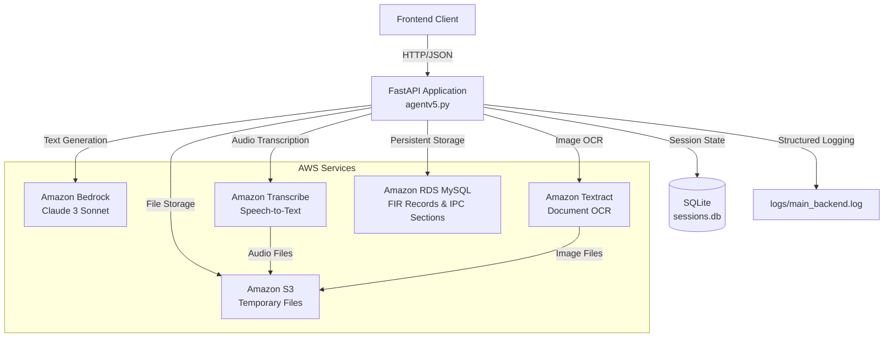
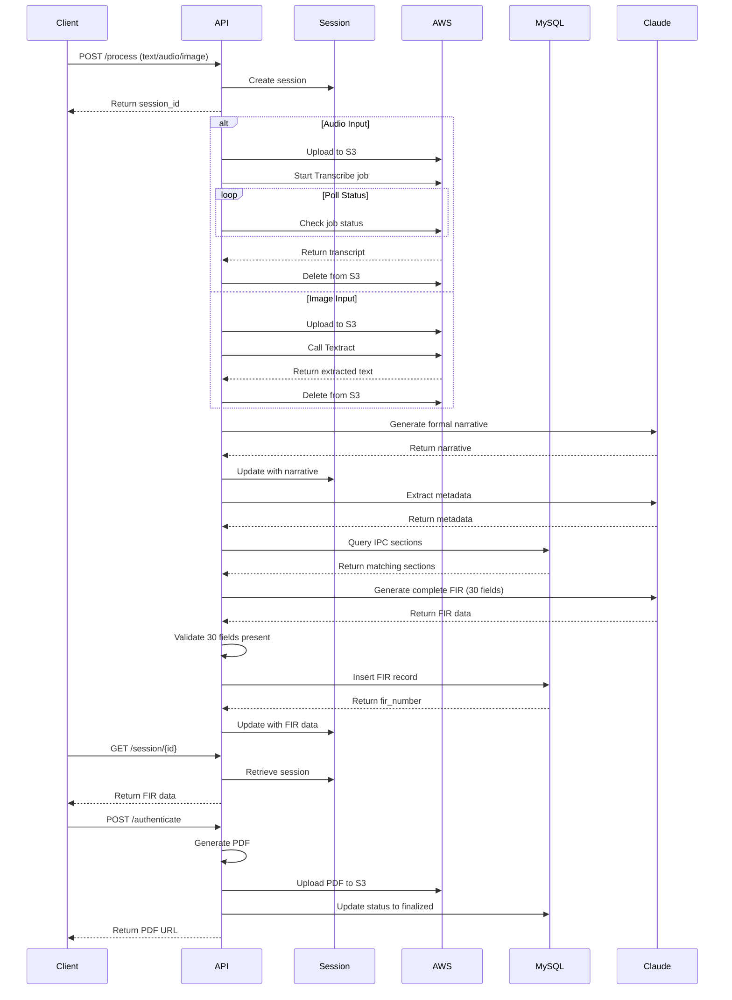

# Design Document: AFIRGen Backend Cleanup for AWS Deployment

## Overview

This design specifies a minimal, production-ready AFIRGen backend that uses AWS managed services (Bedrock, Transcribe, Textract, RDS, S3) exclusively. The design eliminates all self-hosted model infrastructure, broken modules, and unnecessary dependencies that currently prevent successful EC2 deployment.

The backend is a single-file FastAPI application (agentv5.py) that processes complaint inputs (text, audio, or image) through a multi-stage workflow to generate complete, legally-valid First Information Reports (FIRs) with all 30 required fields. The architecture prioritizes simplicity, maintainability, and deployment reliability over complex abstractions.

### Key Design Principles

1. **Minimal Dependencies**: Only 9 essential Python packages (fastapi, uvicorn, pydantic, boto3, mysql-connector-python, python-multipart, httpx, Pillow, reportlab)
2. **Single File Architecture**: All application code in agentv5.py - no directory structure complexity
3. **AWS Managed Services**: No self-hosted models, vector databases, or infrastructure components
4. **Direct SQL Storage**: IPC sections stored as plain text in MySQL RDS, retrieved via LIKE queries
5. **SQLite Sessions**: In-process session management without Redis dependency
6. **Git-Based Deployment**: Simple clone, pip install, uvicorn start workflow

### Workflow Summary

```
Input (Text/Audio/Image) 
  → Transcribe/Textract (if needed)
  → Claude: Generate formal narrative
  → Claude: Extract metadata
  → MySQL: Retrieve relevant IPC sections
  → Claude: Generate complete FIR with all 30 fields
  → MySQL: Store FIR record
  → ReportLab: Generate PDF
  → Return FIR number and session data
```

## Architecture

### High-Level Architecture Diagram



### Component Architecture

The application follows a layered architecture within a single file:

1. **Configuration Layer**: Environment variable loading, validation, and defaults
2. **AWS Client Layer**: Boto3 client initialization for Bedrock, Transcribe, Textract, S3
3. **Database Layer**: MySQL RDS connection pool, SQLite session management
4. **Service Layer**: Business logic for FIR generation workflow
5. **API Layer**: FastAPI endpoints with request/response models
6. **Middleware Layer**: Authentication, rate limiting, security headers, logging

### Deployment Architecture

```
EC2 Instance (98.86.30.145)
├── /home/ubuntu/afirgen-backend/
│   ├── agentv5.py          # Main application
│   ├── requirements.txt     # Dependencies
│   ├── .env                 # Configuration
│   ├── README.md            # Deployment guide
│   ├── sessions.db          # SQLite session storage
│   └── logs/
│       └── main_backend.log # Application logs
```

## Components and Interfaces

### Core Classes

#### 1. AWSServiceClients

Manages all AWS service client initialization and configuration.

```python
class AWSServiceClients:
    """Singleton for AWS service clients"""
    
    def __init__(self, region: str):
        self.region = region
        self.bedrock_runtime = boto3.client('bedrock-runtime', region_name=region)
        self.transcribe = boto3.client('transcribe', region_name=region)
        self.textract = boto3.client('textract', region_name=region)
        self.s3 = boto3.client('s3', region_name=region)
    
    def invoke_claude(self, prompt: str, max_tokens: int = 4096) -> str:
        """Invoke Claude 3 Sonnet via Bedrock"""
        pass
    
    def transcribe_audio(self, s3_uri: str, language_code: str) -> str:
        """Transcribe audio file using AWS Transcribe"""
        pass
    
    def extract_text_from_image(self, s3_uri: str) -> str:
        """Extract text from image using AWS Textract"""
        pass
    
    def upload_to_s3(self, file_bytes: bytes, key: str, bucket: str) -> str:
        """Upload file to S3 with encryption"""
        pass
    
    def delete_from_s3(self, key: str, bucket: str) -> None:
        """Delete file from S3"""
        pass
```

#### 2. DatabaseManager

Handles MySQL RDS and SQLite database operations.

```python
class DatabaseManager:
    """Manages MySQL RDS and SQLite connections"""
    
    def __init__(self, mysql_config: dict):
        self.mysql_pool = mysql.connector.pooling.MySQLConnectionPool(
            pool_name="afirgen_pool",
            pool_size=5,
            **mysql_config
        )
        self.sqlite_conn = sqlite3.connect('sessions.db', check_same_thread=False)
        self._initialize_tables()
    
    def _initialize_tables(self) -> None:
        """Create tables if they don't exist"""
        pass
    
    def insert_fir_record(self, fir_data: dict) -> str:
        """Insert FIR record and return fir_number"""
        pass
    
    def get_fir_by_number(self, fir_number: str) -> dict:
        """Retrieve FIR by number"""
        pass
    
    def list_firs(self, limit: int, offset: int) -> list:
        """List FIRs with pagination"""
        pass
    
    def get_ipc_sections(self) -> list:
        """Retrieve all IPC sections"""
        pass
    
    def create_session(self, session_id: str) -> None:
        """Create new session"""
        pass
    
    def update_session(self, session_id: str, data: dict) -> None:
        """Update session data"""
        pass
    
    def get_session(self, session_id: str) -> dict:
        """Retrieve session data"""
        pass
    
    def cleanup_old_sessions(self) -> None:
        """Delete sessions older than 24 hours"""
        pass
```

#### 3. FIRGenerator

Orchestrates the multi-stage FIR generation workflow.

```python
class FIRGenerator:
    """Orchestrates FIR generation workflow"""
    
    def __init__(self, aws_clients: AWSServiceClients, db: DatabaseManager):
        self.aws = aws_clients
        self.db = db
    
    def generate_from_text(self, text: str, session_id: str) -> dict:
        """Generate FIR from complaint text"""
        pass
    
    def generate_from_audio(self, audio_bytes: bytes, language: str, session_id: str) -> dict:
        """Generate FIR from audio file"""
        pass
    
    def generate_from_image(self, image_bytes: bytes, session_id: str) -> dict:
        """Generate FIR from image file"""
        pass
    
    def _generate_formal_narrative(self, complaint_text: str) -> str:
        """Stage 1: Generate formal narrative using Claude"""
        pass
    
    def _extract_metadata(self, narrative: str) -> dict:
        """Stage 2: Extract metadata using Claude"""
        pass
    
    def _retrieve_ipc_sections(self, metadata: dict) -> list:
        """Stage 3: Retrieve relevant IPC sections from MySQL"""
        pass
    
    def _generate_complete_fir(self, narrative: str, metadata: dict, ipc_sections: list) -> dict:
        """Stage 4: Generate complete FIR with all 30 fields using Claude"""
        pass
    
    def _validate_fir_fields(self, fir_data: dict) -> bool:
        """Validate that all 30 required fields are present"""
        pass
```

#### 4. PDFGenerator

Generates formatted PDF documents from FIR data.

```python
class PDFGenerator:
    """Generates FIR PDF documents"""
    
    def generate_fir_pdf(self, fir_data: dict) -> bytes:
        """Generate PDF from FIR data with all 30 fields"""
        pass
    
    def _add_header(self, canvas, fir_number: str) -> None:
        """Add PDF header with FIR number"""
        pass
    
    def _add_complainant_section(self, canvas, fir_data: dict) -> None:
        """Add complainant details section"""
        pass
    
    def _add_incident_section(self, canvas, fir_data: dict) -> None:
        """Add incident details section"""
        pass
    
    def _add_legal_section(self, canvas, fir_data: dict) -> None:
        """Add legal provisions section"""
        pass
    
    def _add_investigation_section(self, canvas, fir_data: dict) -> None:
        """Add investigation details section"""
        pass
    
    def _add_signature_section(self, canvas, fir_data: dict) -> None:
        """Add signature fields"""
        pass
```

#### 5. RateLimiter

In-memory rate limiting without Redis dependency.

```python
class RateLimiter:
    """In-memory rate limiter"""
    
    def __init__(self, requests_per_minute: int = 100):
        self.requests_per_minute = requests_per_minute
        self.requests: dict[str, list[float]] = {}
        self.lock = threading.Lock()
    
    def is_allowed(self, ip_address: str) -> bool:
        """Check if request is allowed"""
        pass
    
    def _cleanup_old_requests(self, ip_address: str) -> None:
        """Remove requests older than 1 minute"""
        pass
```

### API Endpoints

#### POST /process

Process complaint input and generate FIR.

**Request:**
```python
class ProcessRequest(BaseModel):
    input_type: Literal["text", "audio", "image"]
    text: Optional[str] = None
    language: Optional[str] = "en-IN"  # For audio: "en-IN" or "hi-IN"
```

**Response:**
```python
class ProcessResponse(BaseModel):
    session_id: str
    status: str  # "processing"
    message: str
```

#### GET /session/{session_id}

Poll session status and retrieve results.

**Response:**
```python
class SessionResponse(BaseModel):
    session_id: str
    status: str  # "processing", "completed", "failed"
    transcript: Optional[str] = None
    summary: Optional[str] = None
    violations: Optional[list] = None
    fir_content: Optional[dict] = None
    fir_number: Optional[str] = None
    error: Optional[str] = None
```

#### POST /authenticate

Finalize FIR and generate PDF.

**Request:**
```python
class AuthenticateRequest(BaseModel):
    session_id: str
    complainant_signature: str
    officer_signature: str
```

**Response:**
```python
class AuthenticateResponse(BaseModel):
    fir_number: str
    pdf_url: str
    status: str  # "finalized"
```

#### GET /fir/{fir_number}

Retrieve FIR by number.

**Response:**
```python
class FIRResponse(BaseModel):
    fir_number: str
    session_id: str
    complaint_text: str
    fir_content: dict
    violations_json: list
    status: str
    created_at: str
```

#### GET /firs

List all FIRs with pagination.

**Query Parameters:**
- limit: int (default 20, max 100)
- offset: int (default 0)

**Response:**
```python
class FIRListResponse(BaseModel):
    firs: list[FIRResponse]
    total: int
    limit: int
    offset: int
```

#### GET /health

Health check endpoint.

**Response:**
```python
class HealthResponse(BaseModel):
    status: str  # "healthy" or "unhealthy"
    checks: dict[str, bool]  # {"mysql": true, "bedrock": true}
    timestamp: str
```

## Data Models

### MySQL RDS Schema

#### fir_records Table

```sql
CREATE TABLE IF NOT EXISTS fir_records (
    id INT AUTO_INCREMENT PRIMARY KEY,
    fir_number VARCHAR(50) UNIQUE NOT NULL,
    session_id VARCHAR(100) NOT NULL,
    complaint_text TEXT NOT NULL,
    fir_content JSON NOT NULL,
    violations_json JSON NOT NULL,
    status VARCHAR(20) NOT NULL DEFAULT 'draft',
    created_at TIMESTAMP DEFAULT CURRENT_TIMESTAMP,
    updated_at TIMESTAMP DEFAULT CURRENT_TIMESTAMP ON UPDATE CURRENT_TIMESTAMP,
    INDEX idx_fir_number (fir_number),
    INDEX idx_session_id (session_id),
    INDEX idx_status (status),
    INDEX idx_created_at (created_at)
);
```

**Fields:**
- id: Auto-incrementing primary key
- fir_number: Unique FIR identifier (format: FIR-YYYYMMDD-XXXXX)
- session_id: UUID linking to session
- complaint_text: Original complaint text
- fir_content: JSON containing all 30 FIR template fields
- violations_json: JSON array of IPC sections
- status: "draft", "finalized"
- created_at: Record creation timestamp
- updated_at: Last update timestamp

#### ipc_sections Table

```sql
CREATE TABLE IF NOT EXISTS ipc_sections (
    id INT AUTO_INCREMENT PRIMARY KEY,
    section_number VARCHAR(20) NOT NULL,
    title VARCHAR(500) NOT NULL,
    description TEXT NOT NULL,
    penalty VARCHAR(500),
    created_at TIMESTAMP DEFAULT CURRENT_TIMESTAMP,
    INDEX idx_section_number (section_number),
    FULLTEXT idx_description (description, title)
);
```

**Fields:**
- id: Auto-incrementing primary key
- section_number: IPC section number (e.g., "302", "420")
- title: Section title
- description: Full section description
- penalty: Penalty details
- created_at: Record creation timestamp

### SQLite Schema

#### sessions Table

```sql
CREATE TABLE IF NOT EXISTS sessions (
    session_id TEXT PRIMARY KEY,
    status TEXT NOT NULL,
    transcript TEXT,
    summary TEXT,
    violations TEXT,
    fir_content TEXT,
    fir_number TEXT,
    error TEXT,
    created_at REAL NOT NULL,
    updated_at REAL NOT NULL
);

CREATE INDEX IF NOT EXISTS idx_created_at ON sessions(created_at);
```

**Fields:**
- session_id: UUID primary key
- status: "processing", "completed", "failed"
- transcript: Transcribed/extracted text
- summary: Formal narrative
- violations: JSON string of IPC sections
- fir_content: JSON string of complete FIR
- fir_number: Generated FIR number
- error: Error message if failed
- created_at: Unix timestamp
- updated_at: Unix timestamp

### FIR Content JSON Structure

The fir_content JSON field contains all 30 required FIR template fields:

```json
{
  "complainant_name": "string",
  "complainant_dob": "string",
  "complainant_nationality": "string",
  "complainant_father_husband_name": "string",
  "complainant_address": "string",
  "complainant_contact": "string",
  "complainant_passport": "string",
  "complainant_occupation": "string",
  "incident_date_from": "string",
  "incident_date_to": "string",
  "incident_time_from": "string",
  "incident_time_to": "string",
  "incident_location": "string",
  "incident_address": "string",
  "incident_description": "string",
  "delayed_reporting_reasons": "string",
  "incident_summary": "string",
  "legal_acts": "string",
  "legal_sections": "string",
  "suspect_details": "string",
  "investigating_officer_name": "string",
  "investigating_officer_rank": "string",
  "witnesses": "string",
  "action_taken": "string",
  "investigation_status": "string",
  "date_of_despatch": "string",
  "investigating_officer_signature": "string",
  "investigating_officer_date": "string",
  "complainant_signature": "string",
  "complainant_date": "string"
}
```

### Configuration Model

```python
class Config:
    """Application configuration"""
    
    # AWS Configuration
    AWS_REGION: str = os.getenv("AWS_REGION", "us-east-1")
    S3_BUCKET_NAME: str = os.getenv("S3_BUCKET_NAME")
    BEDROCK_MODEL_ID: str = os.getenv(
        "BEDROCK_MODEL_ID", 
        "anthropic.claude-3-sonnet-20240229-v1:0"
    )
    
    # Database Configuration
    DB_HOST: str = os.getenv("DB_HOST")
    DB_PORT: int = int(os.getenv("DB_PORT", "3306"))
    DB_USER: str = os.getenv("DB_USER", "admin")
    DB_PASSWORD: str = os.getenv("DB_PASSWORD")
    DB_NAME: str = os.getenv("DB_NAME", "afirgen_db")
    
    # API Configuration
    API_KEY: str = os.getenv("API_KEY")
    
    # Rate Limiting
    RATE_LIMIT_PER_MINUTE: int = 100
    
    # File Validation
    MAX_FILE_SIZE_MB: int = 10
    ALLOWED_AUDIO_EXTENSIONS: set = {".wav", ".mp3", ".mpeg"}
    ALLOWED_IMAGE_EXTENSIONS: set = {".jpg", ".jpeg", ".png"}
    
    # Timeouts
    TRANSCRIBE_TIMEOUT_SECONDS: int = 180
    BEDROCK_TIMEOUT_SECONDS: int = 60
    
    # Retry Configuration
    MAX_RETRIES: int = 2
    RETRY_DELAY_SECONDS: int = 2
    
    def validate(self) -> None:
        """Validate required configuration"""
        required = [
            "S3_BUCKET_NAME",
            "DB_HOST",
            "DB_PASSWORD",
            "API_KEY"
        ]
        missing = [key for key in required if not getattr(self, key)]
        if missing:
            raise ValueError(f"Missing required config: {', '.join(missing)}")
```


## FIR Generation Workflow

### Workflow Sequence Diagram



### Stage-by-Stage Processing

#### Stage 1: Input Processing

**Text Input:**
- Validate text is non-empty
- Pass directly to Stage 2

**Audio Input:**
1. Validate file extension (.wav, .mp3, .mpeg)
2. Validate file size < 10MB
3. Generate unique S3 key: `audio/{uuid}.{ext}`
4. Upload to S3 with server-side encryption
5. Start Transcribe job with language code (en-IN or hi-IN)
6. Poll job status every 5 seconds (max 180 seconds)
7. Retrieve transcript text from job results
8. Delete audio file from S3
9. Pass transcript to Stage 2

**Image Input:**
1. Validate file extension (.jpg, .jpeg, .png)
2. Validate file size < 10MB
3. Validate image content using Pillow
4. Generate unique S3 key: `images/{uuid}.{ext}`
5. Upload to S3 with server-side encryption
6. Call Textract DetectDocumentText API
7. Extract plain text from Textract blocks
8. Delete image file from S3
9. Pass extracted text to Stage 2

#### Stage 2: Formal Narrative Generation

**Input:** Raw complaint text (from text/audio/image)

**Process:**
1. Construct Claude prompt with instructions to generate formal narrative
2. Include guidelines for formal police report language
3. Invoke Bedrock with max_tokens=4096
4. Retry up to 2 times on failure with 2-second delay
5. Extract narrative from Claude response
6. Update session with narrative

**Claude Prompt Template:**
```
You are a police officer writing a formal First Information Report (FIR) narrative.

Convert the following complaint into a formal, professional narrative suitable for an official police report:

{complaint_text}

Requirements:
- Use formal, objective language
- Include all relevant details
- Maintain chronological order
- Use third-person perspective
- Be concise but complete

Generate only the formal narrative, no additional commentary.
```

**Output:** Formal narrative text

#### Stage 3: Metadata Extraction

**Input:** Formal narrative

**Process:**
1. Construct Claude prompt requesting structured metadata extraction
2. Specify JSON output format with required fields
3. Invoke Bedrock with max_tokens=2048
4. Parse JSON response
5. Validate required metadata fields present
6. Update session with metadata

**Claude Prompt Template:**
```
Extract structured metadata from this FIR narrative.

Narrative:
{narrative}

Extract the following information in JSON format:
{
  "complainant_name": "string",
  "incident_date": "string",
  "incident_time": "string",
  "incident_location": "string",
  "incident_type": "string",
  "keywords": ["string"]
}

Return only valid JSON, no additional text.
```

**Output:** Metadata dictionary

#### Stage 4: IPC Section Retrieval

**Input:** Metadata (keywords, incident_type)

**Process:**
1. Extract keywords from metadata
2. Construct SQL query with LIKE clauses
3. Query ipc_sections table for matching sections
4. Return top 10 most relevant sections
5. Format sections for Claude context

**SQL Query:**
```sql
SELECT section_number, title, description, penalty
FROM ipc_sections
WHERE description LIKE %keyword1%
   OR description LIKE %keyword2%
   OR title LIKE %keyword1%
   OR title LIKE %keyword2%
LIMIT 10;
```

**Output:** List of IPC section dictionaries

#### Stage 5: Complete FIR Generation

**Input:** Narrative, metadata, IPC sections

**Process:**
1. Construct comprehensive Claude prompt with all context
2. Include all 30 FIR template fields in prompt
3. Include IPC sections as reference material
4. Invoke Bedrock with max_tokens=8192
5. Parse JSON response with all 30 fields
6. Validate all required fields are present and non-empty
7. Generate FIR number (format: FIR-YYYYMMDD-XXXXX)
8. Update session with complete FIR data

**Claude Prompt Template:**
```
Generate a complete First Information Report (FIR) with all required fields.

Formal Narrative:
{narrative}

Metadata:
{metadata_json}

Relevant IPC Sections:
{ipc_sections_formatted}

Generate a complete FIR in JSON format with ALL of the following 30 fields:

{
  "complainant_name": "Full name of complainant",
  "complainant_dob": "Date of birth (DD/MM/YYYY)",
  "complainant_nationality": "Nationality",
  "complainant_father_husband_name": "Father's or husband's name",
  "complainant_address": "Complete address",
  "complainant_contact": "Contact number",
  "complainant_passport": "Passport number (if applicable, else 'N/A')",
  "complainant_occupation": "Occupation",
  "incident_date_from": "Incident start date (DD/MM/YYYY)",
  "incident_date_to": "Incident end date (DD/MM/YYYY)",
  "incident_time_from": "Incident start time (HH:MM)",
  "incident_time_to": "Incident end time (HH:MM)",
  "incident_location": "Location name",
  "incident_address": "Complete incident address",
  "incident_description": "Detailed description",
  "delayed_reporting_reasons": "Reasons for delay (if any, else 'N/A')",
  "incident_summary": "Brief summary",
  "legal_acts": "Applicable legal acts",
  "legal_sections": "Applicable IPC sections",
  "suspect_details": "Suspect information (if known, else 'Unknown')",
  "investigating_officer_name": "Officer name (leave blank for now)",
  "investigating_officer_rank": "Officer rank (leave blank for now)",
  "witnesses": "Witness information (if any, else 'None')",
  "action_taken": "Initial action taken",
  "investigation_status": "Current status",
  "date_of_despatch": "Date of despatch (DD/MM/YYYY)",
  "investigating_officer_signature": "Placeholder for signature",
  "investigating_officer_date": "Date (DD/MM/YYYY)",
  "complainant_signature": "Placeholder for signature",
  "complainant_date": "Date (DD/MM/YYYY)"
}

IMPORTANT: 
- All fields must be present
- Use "N/A" or "Unknown" for unavailable information
- Use "None" for empty lists
- Extract information from the narrative
- Use the provided IPC sections for legal_sections field
- Return only valid JSON

Return the complete JSON object.
```

**Output:** Complete FIR data dictionary with all 30 fields

#### Stage 6: Storage and Finalization

**Process:**
1. Insert FIR record into MySQL fir_records table
2. Store fir_number, session_id, complaint_text, fir_content JSON, violations_json
3. Set status to "draft"
4. Update session with fir_number
5. Set session status to "completed"
6. Return session data to client

### Error Handling in Workflow

**Transcribe Failures:**
- Retry job start up to 2 times
- If timeout (180s), mark session as failed
- Clean up S3 files even on failure
- Log error with job details

**Textract Failures:**
- Retry API call up to 2 times
- If extraction returns empty text, return error
- Clean up S3 files even on failure
- Log error with image details

**Bedrock Failures:**
- Retry invocation up to 2 times with 2s delay
- If JSON parsing fails, retry with clarified prompt
- If field validation fails, log missing fields and retry
- Mark session as failed after max retries
- Log full request/response for debugging

**Database Failures:**
- Retry query up to 2 times
- If connection fails, attempt reconnection
- Mark session as failed on persistent errors
- Log SQL query and error details

**S3 Failures:**
- Retry upload/delete up to 2 times
- Continue workflow even if cleanup fails
- Log S3 operation errors

### Timeout Configuration

- Audio transcription: 180 seconds max
- Image extraction: 30 seconds max
- Bedrock invocation: 60 seconds max per call
- Total workflow: 300 seconds max (5 minutes)

## Error Handling

### Error Categories

#### 1. Input Validation Errors (HTTP 400)

**Triggers:**
- Missing required fields
- Invalid file extension
- File size exceeds 10MB
- Invalid file content (corrupted image/audio)
- Empty text input
- Invalid language code

**Response:**
```json
{
  "error": "Invalid input",
  "detail": "File size exceeds 10MB limit",
  "status_code": 400
}
```

#### 2. Authentication Errors (HTTP 401)

**Triggers:**
- Missing API key header
- Invalid API key
- Expired session

**Response:**
```json
{
  "error": "Authentication failed",
  "detail": "Invalid or missing API key",
  "status_code": 401
}
```

#### 3. Rate Limit Errors (HTTP 429)

**Triggers:**
- More than 100 requests per minute from same IP

**Response:**
```json
{
  "error": "Rate limit exceeded",
  "detail": "Maximum 100 requests per minute",
  "retry_after": 60,
  "status_code": 429
}
```

**Headers:**
```
Retry-After: 60
```

#### 4. AWS Service Errors (HTTP 500)

**Triggers:**
- Bedrock invocation failure
- Transcribe job failure
- Textract API failure
- S3 operation failure

**Handling:**
- Retry up to 2 times with exponential backoff
- Log full error details (service, operation, error code, message)
- Mark session as failed
- Return generic error to client

**Response:**
```json
{
  "error": "Service temporarily unavailable",
  "detail": "Please try again later",
  "status_code": 500
}
```

#### 5. Database Errors (HTTP 500)

**Triggers:**
- MySQL connection failure
- Query execution failure
- SQLite lock timeout

**Handling:**
- Retry query up to 2 times
- Attempt connection pool refresh
- Log SQL query and error
- Return generic error to client

**Response:**
```json
{
  "error": "Database error",
  "detail": "Unable to process request",
  "status_code": 500
}
```

#### 6. Validation Errors (HTTP 500)

**Triggers:**
- Missing FIR fields after generation
- Invalid JSON from Claude
- Malformed data structure

**Handling:**
- Retry generation with clarified prompt
- Log validation failure details
- Mark session as failed after retries

**Response:**
```json
{
  "error": "Generation failed",
  "detail": "Unable to generate valid FIR",
  "status_code": 500
}
```

### Logging Strategy

All errors are logged with structured JSON format:

```json
{
  "timestamp": "2024-01-15T10:30:45.123Z",
  "level": "ERROR",
  "message": "Bedrock invocation failed",
  "context": {
    "service": "bedrock",
    "operation": "invoke_model",
    "model_id": "anthropic.claude-3-sonnet-20240229-v1:0",
    "error_code": "ThrottlingException",
    "error_message": "Rate exceeded",
    "session_id": "abc-123",
    "retry_count": 1
  },
  "stack_trace": "..."
}
```

### Retry Logic

**Exponential Backoff:**
- First retry: 2 seconds delay
- Second retry: 4 seconds delay
- Max retries: 2

**Retryable Errors:**
- Network timeouts
- Throttling errors
- Temporary service unavailability
- Connection errors

**Non-Retryable Errors:**
- Authentication failures
- Invalid input
- Resource not found
- Permission denied

### Error Recovery

**Session Recovery:**
- Sessions persist in SQLite across restarts
- Clients can poll session status after errors
- Failed sessions remain queryable for 24 hours

**Partial Success Handling:**
- If transcription succeeds but generation fails, transcript is saved
- Client can retry generation without re-uploading file
- Session stores intermediate results

**Graceful Degradation:**
- If IPC section retrieval fails, continue with empty list
- If metadata extraction fails, use basic defaults
- Always attempt to generate FIR even with incomplete data

## Testing Strategy

### Unit Testing

The testing strategy uses pytest for unit tests and Hypothesis for property-based tests. Both approaches are complementary and necessary for comprehensive coverage.

**Unit Test Focus:**
- Specific examples demonstrating correct behavior
- Edge cases (empty inputs, boundary conditions)
- Error conditions and exception handling
- Integration points between components

**Test Structure:**
```python
# tests/test_fir_generator.py

def test_generate_fir_number_format():
    """Example: FIR number follows correct format"""
    fir_number = generate_fir_number()
    assert fir_number.startswith("FIR-")
    assert len(fir_number) == 18  # FIR-YYYYMMDD-XXXXX

def test_validate_fir_fields_missing_field():
    """Edge case: Validation fails when field is missing"""
    incomplete_fir = {"complainant_name": "John Doe"}
    assert validate_fir_fields(incomplete_fir) == False

def test_transcribe_audio_invalid_language():
    """Error condition: Invalid language code raises error"""
    with pytest.raises(ValueError):
        transcribe_audio(audio_bytes, language="invalid")
```

**Unit Test Categories:**
1. Configuration validation tests
2. File validation tests (size, extension, content)
3. Database connection tests
4. AWS client initialization tests
5. Session management tests
6. FIR number generation tests
7. Error handling tests

### Property-Based Testing

Property-based tests verify universal properties across many randomly generated inputs using Hypothesis library. Each test runs minimum 100 iterations.

**Configuration:**
```python
from hypothesis import given, settings
from hypothesis import strategies as st

# Run each property test 100 times
@settings(max_examples=100)
```

**Test Tagging:**
Each property test includes a comment referencing the design document property:

```python
# Feature: backend-cleanup-aws, Property 1: FIR field completeness
@settings(max_examples=100)
@given(complaint_text=st.text(min_size=10))
def test_property_fir_contains_all_fields(complaint_text):
    """For any valid complaint text, generated FIR contains all 30 fields"""
    pass
```

### Test Environment

**Local Testing:**
- Use moto library to mock AWS services
- Use in-memory SQLite for session tests
- Use MySQL test container for database tests

**Integration Testing:**
- Test against actual AWS services in dev account
- Use separate test database
- Clean up resources after tests

### Test Coverage Goals

- Line coverage: > 80%
- Branch coverage: > 70%
- Critical paths: 100% (FIR generation workflow)


## Correctness Properties

A property is a characteristic or behavior that should hold true across all valid executions of a system-essentially, a formal statement about what the system should do. Properties serve as the bridge between human-readable specifications and machine-verifiable correctness guarantees.

### Property 1: FIR Field Completeness

For any valid complaint input (text, audio, or image), the generated FIR content SHALL contain all 30 required template fields with non-empty values.

**Validates: Requirements 5.1-5.30, 6.7, 18.5**

### Property 2: FIR Generation Workflow Completeness

For any valid complaint text, the complete workflow SHALL execute all stages in sequence: generate formal narrative, extract metadata, retrieve IPC sections, generate complete FIR, and return a fir_number.

**Validates: Requirements 18.1, 18.2, 18.3, 18.4, 18.7**

### Property 3: Audio Transcription

For any valid audio file (with supported extension and size), the transcription process SHALL produce non-empty transcript text.

**Validates: Requirements 7.7**

### Property 4: Image Text Extraction

For any valid image file (with supported extension and size), the OCR process SHALL produce non-empty extracted text.

**Validates: Requirements 8.4**

### Property 5: FIR Storage Persistence

For any generated FIR, the system SHALL insert a record into the fir_records table containing fir_number, session_id, complaint_text, fir_content, violations_json, status, and created_at fields.

**Validates: Requirements 9.6, 9.7, 18.6**

### Property 6: FIR Storage Round Trip

For any generated FIR, storing it in the database and then retrieving it by fir_number SHALL return equivalent FIR content.

**Validates: Requirements 9.9**

### Property 7: FIR Listing Pagination

For any valid limit and offset parameters, the /firs endpoint SHALL return at most limit FIRs, and requesting subsequent pages SHALL return non-overlapping results.

**Validates: Requirements 9.10**

### Property 8: Status Finalization

For any FIR in "draft" status, calling the authenticate endpoint SHALL update the status to "finalized" in the database.

**Validates: Requirements 9.8**

### Property 9: Unique File Names

For any two file uploads (audio or image), the generated S3 keys SHALL be unique.

**Validates: Requirements 10.4**

### Property 10: Unique Session IDs

For any two FIR generation requests, the created session IDs SHALL be unique.

**Validates: Requirements 13.1**

### Property 11: Session Data Completeness

For any completed session, the session data SHALL contain status, transcript, summary, violations, fir_content, and fir_number fields.

**Validates: Requirements 13.6**

### Property 12: Session Round Trip

For any created session, polling the session endpoint SHALL return the current session data including all stored fields.

**Validates: Requirements 13.7**

### Property 13: Error Message Security

For any error response, the error message SHALL NOT contain sensitive information such as passwords, API keys, database credentials, or internal file paths.

**Validates: Requirements 14.7**

### Property 14: Process Response Format

For any valid /process request, the response SHALL contain a session_id field.

**Validates: Requirements 15.3**

### Property 15: Session Response Format

For any valid /session/{session_id} request, the response SHALL contain status, transcript, summary, violations, and fir_content fields.

**Validates: Requirements 15.5**

### Property 16: API Authentication

For any endpoint except /health, requests without a valid API key SHALL be rejected with HTTP 401 status.

**Validates: Requirements 15.10**

### Property 17: IPC Section Schema

For any IPC section stored in the database, the record SHALL contain section_number, title, description, and penalty fields.

**Validates: Requirements 17.2**

### Property 18: PDF Generation

For any valid FIR content, the PDF generation process SHALL produce a non-empty PDF document.

**Validates: Requirements 19.1**

### Property 19: PDF Field Completeness

For any generated PDF, the document SHALL include all 30 FIR template fields including complainant signature and investigating officer signature fields.

**Validates: Requirements 19.2, 19.4, 19.5**

### Property 20: PDF URL Response

For any successful authenticate request, the response SHALL contain a pdf_url field with a valid S3 URL.

**Validates: Requirements 19.9**

### Property 21: Security Headers

For any API response, the response headers SHALL include X-Content-Type-Options, X-Frame-Options, and X-XSS-Protection headers.

**Validates: Requirements 22.1, 22.2, 22.3**

### Property 22: Audio File Validation

For any audio file upload, files with extensions other than .wav, .mp3, or .mpeg SHALL be rejected with HTTP 400 status.

**Validates: Requirements 23.1**

### Property 23: Image File Validation

For any image file upload, files with extensions other than .jpg, .jpeg, or .png SHALL be rejected with HTTP 400 status.

**Validates: Requirements 23.2**

### Property 24: File Size Validation

For any file upload, files larger than 10MB SHALL be rejected with HTTP 400 status.

**Validates: Requirements 23.3**

### Property 25: Content Type Validation

For any file upload, files where the actual content does not match the declared content type SHALL be rejected with HTTP 400 status.

**Validates: Requirements 23.4**

### Property 26: Invalid File Rejection

For any file that fails validation (extension, size, or content type), the system SHALL NOT process the file or generate a FIR.

**Validates: Requirements 23.6**

### Property 27: Health Check Response Format

For any /health request, the response SHALL contain a status field and a checks dictionary with details for each health check component.

**Validates: Requirements 24.7**


## Configuration Management

### Environment Variables

All configuration is managed through environment variables, loaded from a .env file or system environment.

**Required Variables:**
```bash
# AWS Configuration
AWS_REGION=us-east-1
S3_BUCKET_NAME=afirgen-files

# Database Configuration
DB_HOST=afirgen-free-tier-mysql.ceniwmoioy4y.us-east-1.rds.amazonaws.com
DB_PORT=3306
DB_USER=admin
DB_PASSWORD=<secure-password>
DB_NAME=afirgen_db

# API Configuration
API_KEY=<secure-api-key>
```

**Optional Variables with Defaults:**
```bash
# Bedrock Model
BEDROCK_MODEL_ID=anthropic.claude-3-sonnet-20240229-v1:0

# Rate Limiting
RATE_LIMIT_PER_MINUTE=100

# File Validation
MAX_FILE_SIZE_MB=10

# Timeouts
TRANSCRIBE_TIMEOUT_SECONDS=180
BEDROCK_TIMEOUT_SECONDS=60

# Retry Configuration
MAX_RETRIES=2
RETRY_DELAY_SECONDS=2
```

### Configuration Validation

On application startup, the system validates all required environment variables:

```python
def validate_config():
    """Validate required configuration on startup"""
    required_vars = [
        "S3_BUCKET_NAME",
        "DB_HOST",
        "DB_PASSWORD",
        "API_KEY"
    ]
    
    missing = []
    for var in required_vars:
        if not os.getenv(var):
            missing.append(var)
    
    if missing:
        logger.error(f"Missing required environment variables: {', '.join(missing)}")
        sys.exit(1)
    
    logger.info("Configuration validated successfully")
```

### AWS Credentials

AWS credentials are managed through standard AWS credential chain:
1. Environment variables (AWS_ACCESS_KEY_ID, AWS_SECRET_ACCESS_KEY)
2. AWS credentials file (~/.aws/credentials)
3. IAM role (for EC2 instances)

For EC2 deployment, IAM role is the recommended approach.

### Database Initialization

On first startup, the application creates required database tables:

```python
def initialize_database():
    """Create tables if they don't exist"""
    
    # MySQL RDS tables
    fir_records_table = """
    CREATE TABLE IF NOT EXISTS fir_records (
        id INT AUTO_INCREMENT PRIMARY KEY,
        fir_number VARCHAR(50) UNIQUE NOT NULL,
        session_id VARCHAR(100) NOT NULL,
        complaint_text TEXT NOT NULL,
        fir_content JSON NOT NULL,
        violations_json JSON NOT NULL,
        status VARCHAR(20) NOT NULL DEFAULT 'draft',
        created_at TIMESTAMP DEFAULT CURRENT_TIMESTAMP,
        updated_at TIMESTAMP DEFAULT CURRENT_TIMESTAMP ON UPDATE CURRENT_TIMESTAMP,
        INDEX idx_fir_number (fir_number),
        INDEX idx_session_id (session_id),
        INDEX idx_status (status),
        INDEX idx_created_at (created_at)
    );
    """
    
    ipc_sections_table = """
    CREATE TABLE IF NOT EXISTS ipc_sections (
        id INT AUTO_INCREMENT PRIMARY KEY,
        section_number VARCHAR(20) NOT NULL,
        title VARCHAR(500) NOT NULL,
        description TEXT NOT NULL,
        penalty VARCHAR(500),
        created_at TIMESTAMP DEFAULT CURRENT_TIMESTAMP,
        INDEX idx_section_number (section_number),
        FULLTEXT idx_description (description, title)
    );
    """
    
    # SQLite sessions table
    sessions_table = """
    CREATE TABLE IF NOT EXISTS sessions (
        session_id TEXT PRIMARY KEY,
        status TEXT NOT NULL,
        transcript TEXT,
        summary TEXT,
        violations TEXT,
        fir_content TEXT,
        fir_number TEXT,
        error TEXT,
        created_at REAL NOT NULL,
        updated_at REAL NOT NULL
    );
    """
    
    sessions_index = """
    CREATE INDEX IF NOT EXISTS idx_created_at ON sessions(created_at);
    """
    
    # Execute table creation
    execute_mysql_query(fir_records_table)
    execute_mysql_query(ipc_sections_table)
    execute_sqlite_query(sessions_table)
    execute_sqlite_query(sessions_index)
    
    logger.info("Database tables initialized")
```

### IPC Sections Loading

On first startup, if ipc_sections table is empty, load from JSON file:

```python
def load_ipc_sections():
    """Load IPC sections from JSON file if table is empty"""
    
    # Check if table has data
    count = execute_mysql_query("SELECT COUNT(*) FROM ipc_sections")[0][0]
    
    if count > 0:
        logger.info(f"IPC sections already loaded: {count} sections")
        return
    
    # Load from JSON file
    with open('ipc_sections.json', 'r') as f:
        sections = json.load(f)
    
    # Insert into database
    for section in sections:
        query = """
        INSERT INTO ipc_sections (section_number, title, description, penalty)
        VALUES (%s, %s, %s, %s)
        """
        execute_mysql_query(query, (
            section['section_number'],
            section['title'],
            section['description'],
            section.get('penalty', '')
        ))
    
    logger.info(f"Loaded {len(sections)} IPC sections")
```

## Code Organization

### Single File Structure

The entire application is organized in agentv5.py with clear section markers:

```python
# agentv5.py

"""
AFIRGen Backend - AWS Bedrock Architecture
Minimal, production-ready FIR generation system
"""

# ============================================================================
# IMPORTS
# ============================================================================
import os
import sys
import json
import uuid
import time
import logging
import threading
from datetime import datetime, timedelta
from typing import Optional, Literal, Dict, List, Any

import boto3
import mysql.connector
from mysql.connector import pooling
import sqlite3
from fastapi import FastAPI, File, UploadFile, Header, HTTPException, Request
from fastapi.responses import JSONResponse, FileResponse
from fastapi.middleware.cors import CORSMiddleware
from pydantic import BaseModel
import uvicorn
from PIL import Image
from reportlab.lib.pagesizes import letter
from reportlab.pdfgen import canvas
import httpx


# ============================================================================
# CONFIGURATION
# ============================================================================
class Config:
    """Application configuration from environment variables"""
    # ... configuration class ...


# ============================================================================
# LOGGING SETUP
# ============================================================================
def setup_logging():
    """Configure structured JSON logging"""
    # ... logging setup ...


# ============================================================================
# AWS SERVICE CLIENTS
# ============================================================================
class AWSServiceClients:
    """Manages AWS service clients"""
    # ... AWS client class ...


# ============================================================================
# DATABASE MANAGEMENT
# ============================================================================
class DatabaseManager:
    """Manages MySQL RDS and SQLite connections"""
    # ... database manager class ...


# ============================================================================
# RATE LIMITING
# ============================================================================
class RateLimiter:
    """In-memory rate limiter"""
    # ... rate limiter class ...


# ============================================================================
# FIR GENERATOR
# ============================================================================
class FIRGenerator:
    """Orchestrates FIR generation workflow"""
    # ... FIR generator class ...


# ============================================================================
# PDF GENERATOR
# ============================================================================
class PDFGenerator:
    """Generates FIR PDF documents"""
    # ... PDF generator class ...


# ============================================================================
# API MODELS
# ============================================================================
class ProcessRequest(BaseModel):
    """Request model for /process endpoint"""
    # ... API models ...


# ============================================================================
# FASTAPI APPLICATION
# ============================================================================
app = FastAPI(title="AFIRGen Backend", version="2.0.0")

# Middleware
app.add_middleware(CORSMiddleware, allow_origins=["*"])

# Global instances
config = Config()
aws_clients = AWSServiceClients(config.AWS_REGION)
db_manager = DatabaseManager(config.get_mysql_config())
rate_limiter = RateLimiter(config.RATE_LIMIT_PER_MINUTE)
fir_generator = FIRGenerator(aws_clients, db_manager)
pdf_generator = PDFGenerator()


# ============================================================================
# MIDDLEWARE
# ============================================================================
@app.middleware("http")
async def add_security_headers(request: Request, call_next):
    """Add security headers to all responses"""
    # ... middleware implementation ...


@app.middleware("http")
async def rate_limit_middleware(request: Request, call_next):
    """Rate limiting middleware"""
    # ... middleware implementation ...


# ============================================================================
# API ENDPOINTS
# ============================================================================
@app.post("/process")
async def process_complaint(request: ProcessRequest, x_api_key: str = Header(...)):
    """Process complaint and generate FIR"""
    # ... endpoint implementation ...


@app.get("/session/{session_id}")
async def get_session(session_id: str, x_api_key: str = Header(...)):
    """Get session status and data"""
    # ... endpoint implementation ...


@app.post("/authenticate")
async def authenticate_fir(request: AuthenticateRequest, x_api_key: str = Header(...)):
    """Finalize FIR and generate PDF"""
    # ... endpoint implementation ...


@app.get("/fir/{fir_number}")
async def get_fir(fir_number: str, x_api_key: str = Header(...)):
    """Retrieve FIR by number"""
    # ... endpoint implementation ...


@app.get("/firs")
async def list_firs(limit: int = 20, offset: int = 0, x_api_key: str = Header(...)):
    """List all FIRs with pagination"""
    # ... endpoint implementation ...


@app.get("/health")
async def health_check():
    """Health check endpoint"""
    # ... endpoint implementation ...


# ============================================================================
# STARTUP AND SHUTDOWN
# ============================================================================
@app.on_event("startup")
async def startup_event():
    """Initialize application on startup"""
    # ... startup logic ...


@app.on_event("shutdown")
async def shutdown_event():
    """Graceful shutdown"""
    # ... shutdown logic ...


# ============================================================================
# MAIN
# ============================================================================
if __name__ == "__main__":
    uvicorn.run(app, host="0.0.0.0", port=8000)
```

### Dependencies File

requirements.txt contains only essential dependencies:

```
fastapi==0.104.1
uvicorn[standard]==0.24.0
pydantic==2.5.0
boto3==1.29.7
mysql-connector-python==8.2.0
python-multipart==0.0.6
httpx==0.25.1
Pillow==10.1.0
reportlab==4.0.7
```

### README.md

Deployment guide for EC2:

```markdown
# AFIRGen Backend - AWS Deployment

## Prerequisites

- Python 3.11+
- AWS credentials configured
- MySQL RDS instance running
- S3 bucket created

## Deployment Steps

1. Clone repository:
   ```bash
   git clone <repository-url>
   cd afirgen-backend
   ```

2. Create virtual environment:
   ```bash
   python3 -m venv venv
   source venv/bin/activate
   ```

3. Install dependencies:
   ```bash
   pip install -r requirements.txt
   ```

4. Configure environment:
   ```bash
   cp .env.example .env
   # Edit .env with your configuration
   ```

5. Start application:
   ```bash
   uvicorn agentv5:app --host 0.0.0.0 --port 8000
   ```

## Production Deployment

Use systemd service for production:

```bash
sudo cp afirgen.service /etc/systemd/system/
sudo systemctl enable afirgen
sudo systemctl start afirgen
```

## Health Check

```bash
curl http://localhost:8000/health
```

## Logs

Application logs are written to `logs/main_backend.log`
```

### .env.example

Template for environment configuration:

```bash
# AWS Configuration
AWS_REGION=us-east-1
S3_BUCKET_NAME=your-bucket-name

# Database Configuration
DB_HOST=your-rds-endpoint.rds.amazonaws.com
DB_PORT=3306
DB_USER=admin
DB_PASSWORD=your-secure-password
DB_NAME=afirgen_db

# API Configuration
API_KEY=your-secure-api-key

# Optional Configuration
BEDROCK_MODEL_ID=anthropic.claude-3-sonnet-20240229-v1:0
RATE_LIMIT_PER_MINUTE=100
MAX_FILE_SIZE_MB=10
```

## Security Considerations

### API Key Authentication

All endpoints except /health require API key in X-API-Key header:

```python
def verify_api_key(x_api_key: str = Header(...)):
    """Verify API key"""
    if x_api_key != config.API_KEY:
        raise HTTPException(status_code=401, detail="Invalid API key")
```

### File Upload Security

1. Extension validation (whitelist only)
2. Size validation (max 10MB)
3. Content type validation (verify actual content)
4. Temporary storage in S3 with encryption
5. Immediate cleanup after processing

### Database Security

1. Parameterized queries (prevent SQL injection)
2. Connection pooling with limits
3. Credentials from environment variables
4. No sensitive data in logs

### Error Message Security

1. Generic error messages to clients
2. Detailed errors only in logs
3. No stack traces in API responses
4. No credential exposure

### Security Headers

All responses include:
- X-Content-Type-Options: nosniff
- X-Frame-Options: DENY
- X-XSS-Protection: 1; mode=block
- Strict-Transport-Security (for HTTPS)
- Content-Security-Policy

## Performance Considerations

### Connection Pooling

MySQL connection pool with 5 connections:
```python
pool = mysql.connector.pooling.MySQLConnectionPool(
    pool_name="afirgen_pool",
    pool_size=5,
    **mysql_config
)
```

### Rate Limiting

In-memory rate limiting with 100 requests/minute per IP:
- Prevents abuse
- No Redis dependency
- Automatic cleanup of old requests

### Async Processing

FastAPI async endpoints for I/O operations:
- Non-blocking AWS API calls
- Concurrent request handling
- Efficient resource utilization

### Timeout Configuration

Appropriate timeouts for each operation:
- Transcribe: 180 seconds (long audio files)
- Textract: 30 seconds (image processing)
- Bedrock: 60 seconds (text generation)
- Total workflow: 300 seconds max

## Monitoring and Observability

### Structured Logging

JSON-formatted logs with context:
```json
{
  "timestamp": "2024-01-15T10:30:45.123Z",
  "level": "INFO",
  "message": "FIR generated successfully",
  "context": {
    "session_id": "abc-123",
    "fir_number": "FIR-20240115-00001",
    "duration_ms": 4523
  }
}
```

### Health Checks

/health endpoint checks:
- MySQL RDS connectivity
- AWS Bedrock access
- Application status

### Metrics to Monitor

1. Request rate and latency
2. Error rate by endpoint
3. AWS service call latency
4. Database query performance
5. Session creation rate
6. FIR generation success rate

## Deployment Checklist

- [ ] Python 3.11+ installed
- [ ] AWS credentials configured (IAM role for EC2)
- [ ] MySQL RDS instance accessible
- [ ] S3 bucket created with appropriate permissions
- [ ] Environment variables configured in .env
- [ ] Dependencies installed from requirements.txt
- [ ] Database tables initialized
- [ ] IPC sections loaded
- [ ] Health check returns 200
- [ ] API key authentication working
- [ ] Rate limiting functional
- [ ] Logs directory created
- [ ] Systemd service configured (production)
- [ ] Firewall rules configured (port 8000)

## Troubleshooting

### Application won't start

1. Check environment variables: `python -c "from agentv5 import config; config.validate()"`
2. Check database connectivity: `mysql -h $DB_HOST -u $DB_USER -p`
3. Check AWS credentials: `aws sts get-caller-identity`
4. Check logs: `tail -f logs/main_backend.log`

### FIR generation fails

1. Check Bedrock access: `aws bedrock list-foundation-models --region us-east-1`
2. Check S3 bucket access: `aws s3 ls s3://$S3_BUCKET_NAME`
3. Check session status: `curl http://localhost:8000/session/{session_id}`
4. Check logs for detailed error messages

### Database errors

1. Check RDS status in AWS console
2. Verify security group allows EC2 access
3. Test connection: `mysql -h $DB_HOST -u $DB_USER -p`
4. Check connection pool: Look for "Too many connections" errors

## Summary

This design provides a minimal, maintainable AFIRGen backend that:

1. Uses only AWS managed services (no self-hosted infrastructure)
2. Fits in a single Python file for simplicity
3. Has minimal dependencies (9 packages)
4. Deploys via simple git clone workflow
5. Generates complete, legally-valid FIRs with all 30 required fields
6. Includes comprehensive error handling and retry logic
7. Implements security best practices
8. Provides structured logging and health checks
9. Supports text, audio, and image complaint inputs
10. Stores data persistently in MySQL RDS

The architecture prioritizes deployment reliability, operational simplicity, and maintainability over complex abstractions.
