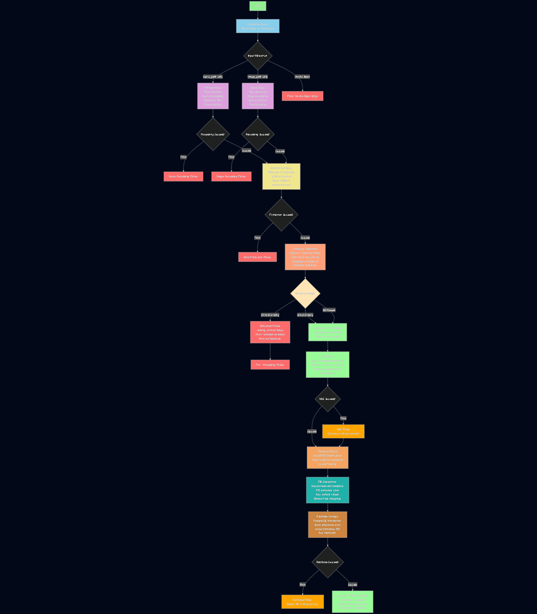

# ⚖️ AFIRGen – AI-based FIR Generation System

AFIRGen is an AI-powered system built to automate **First Information Report (FIR)** generation using real-world Indian legal data (BNS).  
It combines **Speech-to-Text (STT)**, **Optical Character Recognition (OCR)**, **Retrieval-Augmented Generation (RAG)**, and **Large Language Models (LLMs)** to create accurate, structured, and law-compliant FIR drafts in real time.

---

## 🧠 Overview
- Uses **Whisper** for speech-to-text and **Donut OCR** for image-to-text extraction.  
- Implements a **RAG pipeline** (with RAG model) to pull relevant BNS sections and contextual data.  
- Fine-tuned **LLaMA**, **Mistral**, and other open-weight LLMs on Indian Law and Alpaca-style datasets.  
- Integrates all components into a **modular FastAPI backend** connected to a **PostgreSQL** database.  

---

## 🧩 Design Documents
- [📄 Design Document (PPT version)](https://www.dropbox.com/scl/fi/uqh8n3i9vfo0t3zq8bpsl/Design.pptx?rlkey=npz59jbcbgqjw819vjuax3mp9&st=lj6zfrx5&dl=0)  
- [📘 Design Document (PDF version)](https://www.dropbox.com/scl/fi/l2u33zvy8e76ahx5fv9ax/Design.pdf?rlkey=jnohv4villlx1i075bugz26io&st=n41qy9e7&dl=0)

---

## 🧰 Tech Stack
**Python**, **FastAPI**, **LLaMA**, **Mistral**, **Whisper**, **Donut OCR**, **IndicBERT**, **PostgreSQL**, **Docker**

---

## ⚙️ System Flow

Here’s the system architecture — showing how each module connects and processes data through the pipeline:

---

## 🚀 Highlights
- Fine-tuned open-weight LLMs for **domain-specific legal accuracy**.  
- Backend optimized for **low-latency inference** and **real-time responses**.  
- Seamless integration of multiple AI modules for **end-to-end FIR automation**.

---

## 🔮 Future Work
- Refine the **frontend UX** for smoother interaction.  
- Add new features like case classification and legal section summarization.  
- Deploy the entire system to the **cloud** for scalable and public access (currently runs locally).

---

## 👥 Contributors
- **Navaneeth Kutty**  
- **Priyan M S K**

---

## 🏁 Summary
AFIRGen showcases how GenAI can transform the Indian legal process by automating complex document workflows — bridging AI, law, and real-world applications.

---
